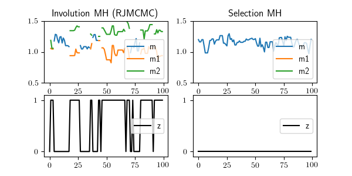

# Markov chain Monte Carlo (MCMC)

Markov chain Monte Carlo (MCMC) is an approach to inference which involves initializing a hypothesis and then repeatedly sampling a new hypotheses given the previous hypothesis by making a change to the previous hypothesis.
The function that samples the new hypothesis given the previous hypothesis is called the **MCMC kernel** (or `kernel' for short).
If we design the kernel appropriately, then the distribution of the hypotheses will converge to the conditional (i.e. posterior) distribution as we increase the number of times we apply the kernel.

Gen includes primitives for constructing MCMC kernels and composing them into MCMC algorithms.
Although Gen encourages you to write MCMC algorithms that converge to the conditional distribution, Gen does not enforce this requirement.
You may use Gen's MCMC primitives in other ways, including for stochastic optimization.

For background on MCMC see [1].

[1] Andrieu, Christophe, et al. "An introduction to MCMC for machine learning." Machine learning 50.1-2 (2003): 5-43. [Link](https://www.cs.ubc.ca/~arnaud/andrieu_defreitas_doucet_jordan_intromontecarlomachinelearning.pdf).

## MCMC in Gen
Suppose we are doing inference in the following toy model:
```julia
@gen function model()
    x = @trace(bernoulli(0.5), :x) # a latent variable
    @trace(normal(x ? -1. : 1., 1.), :y) # the variable that will be observed
end
```

To do MCMC, we first need to obtain an initial trace of the model.
Recall that a trace encodes both the observed data and hypothesized values of latent variables.
We can obtain an initial trace that encodes the observed data, and contains a randomly initialized hypothesis, using [`generate`](@ref), e.g.:
```julia
observations = choicemap((:y, 1.23))
trace, = generate(model, (), observations)
```

Then, an MCMC algorithm is Gen is implemented simply by writing Julia `for` loop, which repeatedly applies a kernel, which is a regular Julia function:
```julia
for i=1:100
    trace = kernel(trace)
end
```

## Built-in Stationary Kernels
However, we don't expect to be able to use any function for `kernel` and expect to converge to the conditional distribution.
To converge to the conditional distribution, the kernels must satisfy some properties.
One of these properties is that the kernel is **stationary** with respect to the conditional distribution.
Gen's inference library contains a number of functions for constructing stationary kernels:

- [`metropolis_hastings`](@ref) with alias [`mh`](@ref), which has three variants with differing tradeoffs between ease-of-use and efficiency. The simplest variant simply requires you to select the set of random choices to be updated, without specifying how. The middle variant allows you to use custom proposals that encode problem-specific heuristics, or custom proposals based on neural networks that are trained via amortized inference. The most sophisticated variant allows you to specify any kernel in the [reversible jump MCMC](https://people.maths.bris.ac.uk/~mapjg/papers/RJMCMCBka.pdf) framework.

- [`mala`](@ref), which performs a Metropolis Adjusted Langevin algorithm update on a set of selected random choices.

- [`hmc`](@ref), which performs a Hamiltonian Monte Carlo update on a set of selected random choices.

- [`elliptical_slice`](@ref), which performs an elliptical slice sampling update on a selected multivariate normal random choice.

For example, here is an MCMC inference algorithm that uses [`mh`](@ref):
```julia
function do_inference(y, num_iters)
    trace, = generate(model, (), choicemap((:y, y)))
    xs = Float64[]
    for i=1:num_iters
        trace, = mh(trace, select(:x))
        push!(xs, trace[:x])
    end
    xs
end
```

Note that each of the kernel functions listed above stationary with respect to the joint distribution on traces of the model, but may not be stationary with respect to the intended conditional distribution, which is determined by the set of addresses that consititute the observed data.
If a kernel modifies the values of any of the observed data, then the kernel is not stationary with respect to the conditional distribution.
Therefore, you should **ensure that your MCMC kernels never propose to the addresses of the observations**.

Note that stationarity with respect to the conditional distribution alone is not sufficient for a kernel to converge to the posterior with infinite iterations.
Other requirements include that the chain is **irreducible** (it is possible to get from any state to any other state in a finite number of steps), and **aperiodicity**, which is a more complex requirement that is satisfied when kernels have some probability of staying in the same state, which most of the primitive kernels above satisfy.
We refer interested readers to [1] for additional details on MCMC convergence.

## Enabling Dynamic Checks

Gen does not statically guarantee that kernels (either ones built-in or composed with the [Composite Kernel DSL](@ref)) are stationary.
However, you can enable dynamic checks that will detect common bugs that break stationarity.
To enable the dynamic checks we pass a keyword argument beyond those of the kernel itself:
```julia
new_trace = k(trace, 2, check=true)
```
Note that these checks aim to detect when a kernel is not stationary with respect to the model's **joint** distribution.
To add an additional dynamic check for violation of stationarity with respect to the *conditional* distribution (conditioned on observations), we pass in an additional keyword argument containing a choice map with the observations:
```julia
new_trace = k(traced, 2, check=true, observations=choicemap((:y, 1.2)))
```
If `check` is set to `false`, then the observation check is not performed.

## Composite Kernel DSL

You can freely compose the primitive kernels listed above into more complex kernels.
Common types of composition including e.g. cycling through multiple kernels, randomly choosing a kernel to apply, and choosing which kernel to apply based on the current state.
However, not all such compositions of stationary kernels will result in kernels that are themselves stationary.

Gen's **Composite Kernel DSL** is an embedded inference DSL that allows for more safe composition of MCMC kernels, by formalizing properties of the compositions that are sufficient for stationarity, encouraging compositions with these properties, and dynamically checking for violation of these properties.
Although the DSL does not *guarantee* stationarity of the composite kernels, its dynamic checks do catch common cases of non-stationary kernels.
The dynamic checks can be enabled and disabled as needed (e.g. enabled during testing and prototyping and disabled during deployment for higher performance).

The DSL consists of a macro -- [`@kern`](@ref) for composing stationary kernels from primitive stationary kernels and composite stationary kernels, and two additional macros:
--- [`@pkern`](@ref) for declaring Julia functions to be custom primitive stationary kernels, and [`@rkern`](@ref) for declaring the reversal of a custom primitive kernel (these two macros are advanced features not necessary for standard MCMC algorithms).

### Composing Stationary Kernels

The [`@kern`](@ref) macro defines a composite MCMC kernel in a restricted DSL that is based on Julia's own function definition syntax.

Suppose we are doing inference in the following model:
```julia
@gen function model()
    n = @trace(geometric(0.5), :n)
    total = 0.
    for i=1:n
        total += @trace(normal(0, 1), (:x, i))
    end
    @trace(normal(total, 1.), :y)
    total
end
```

Here is an example composite kernel for MCMC in this model:
```julia
@kern function my_kernel(trace)
    
    # cycle through the x's and do a random walk update on each one
    for i in 1:trace[:n]
        trace ~ mh(trace, random_walk_proposal, (i,))
    end

    # repeatedly pick a random x and do a random walk update on it
    if trace[:n] > 0
        for rep in 1:10
            let i ~ uniform_discrete(1, trace[:n])
                trace ~ mh(trace, random_walk_proposal, (i,))
            end
        end
    end

    # remove the last x, or add a new one, a random number of times
    let n_add_remove_reps ~ uniform_discrete(0, max_n_add_remove)
        for rep in 1:n_add_remove_reps
            trace ~ mh(trace, add_remove_proposal, (), add_remove_involution)
        end
    end
end
```

In the DSL, the first arugment (`trace` in this case) represents the trace on which the kernel is acting.
the kernel may have additional arguments.
The code inside the body can read from the trace (e.g. `trace[:n]` reads the value of the random choice `:n`).
Finally, the return value of the composite kernel is automatically set to the trace.
NOTE: It is not permitted to assign to the trace variable, except with `~` expressions.
Also note that stationary kernels, when treated as Julia functions, return a tuple, where the first element is the trace and the remaining arguments are metadata.
When applying these kernels with `~` syntax within the DSL, it is not necessary to unpack the tuple (the metadata is ignored automatically).

The language constructs supported by this DSL are:

**Applying a stationary kernel.**
To apply a kernel, the syntax `trace ~ k(trace, args..)` is used.
Note that the `check` and `observations` keyword arguments (see [Enabling Dynamic Checks](@ref)) should not be used here; they will be added automatically.

**For loops.**
The range of the for loop may be a deterministic function of the trace (as in `trace[:n]` above).
The range must be *invariant* under all possible executions of the body of the for loop.
For example, the random walk based kernel embedded in the for loop in our example above cannot modify the value of the random choice `:n` in the trace.

**If-end expressions**
The predicate condition may be a deterministic function of the trace, but it also must be invariant (i.e. remain true) under all possible executions of the body.

**Deterministic let expressions.**
We can use `let x = value .. end` to bind values to a variable, but the expression on the right-hand-side must be deterministic function of its free variables, its value must be invariant under all possible executions of the body.

**Stochastic let expressions.**
We can use `let x ~ dist(args...) .. end` to sample a stochastic value and bind to a variable, but the expression on the right-hand-side must be the application of a Gen [`Distribution`](@ref) to arguments, and the distribution and its arguments must be invariant under all possible executions of the body.


### Declaring primitive kernels for use in composite kernels

Note that all calls to built-in kernels like [`mh`](@ref) should be stationary, but that users are also free to declare their own arbitrary code as stationary.
The [`@pkern`](@ref) macro declares a Julia function as a stationary MCMC kernel, for use with the MCMC Kernel DSL.
The following custom primitive kernel permutes the random variables using random permutation generated from outside of Gen: 
```julia
@pkern function permute_move(trace; check=false, observations=EmptyChoiceMap())
    perm = Random.randperm(trace[:n])
    constraints = choicemap()
    for (i, j) in enumerate(perm)
        constraints[(:x, i)] = trace[(:x, j)]
        constraints[(:x, j)] = trace[(:x, i)]
    end
    trace, = update(trace, (), (), constraints)
    metadata = nothing
    trace, metadata
end
```
The first argument to the function should be the trace, and the function must have keyword arguments `check` and `observations` (see [Enabling Dynamic Checks](@ref)).
The return value should be a tuple where the first element is the new trace (and any remaining elements are optional metadata).

**Primitive kernels are Julia functions.**
Note that although we will be invoking these kernels within [`@kern`](@ref) functions, these kernels can still be called like a regular Julia function.
```julia
new_trace = permute_move(trace, 2)
```
Indeed, they are just regular Julia functions, but with some extra information attached so that the composite kernel DSL knows they have been declared as stationary kernels.


## Involutive MCMC

Gen's most flexible variant of [`metropolis_hastings`](@ref), called **Involutive MCMC**, allows users to specify any MCMC kernel in the reversible jump MCMC (RJMCMC) framework [2].
Involution MCMC allows you to express a broad class of custom MCMC kernels that are not expressible using the other, simpler variants of Metropolis-Hastings supported by Gen.
These kernels are particularly useful for inferring the structure (e.g. control flow) of a model.

[2] Green, Peter J. "Reversible jump Markov chain Monte Carlo computation and Bayesian model determination." Biometrika 82.4 (1995): 711-732. [Link](https://academic.oup.com/biomet/article-abstract/82/4/711/252058)

An involutive MCMC kernel in Gen takes as input a previous trace of the model (whose choice map we will denote by ``t``), and performs three phases to obtain a new trace of the model:

- First, it traces the execution of a **proposal**, which is an auxiliary generative function that takes the previous trace of the model as its first argument. Mathematically, we will denote the choice map associated with the trace of the proposal by ``u``. The proposal can of course be defined using the [Built-In Modeling Languages](@ref), just like the model itself. However, unlike many other uses of proposals in Gen, these proposals *can make random choices at addresses that the model does not*.

- Next, it takes the tuple ``(t, u)`` and passes it into an **involution** (denoted mathematically by ``h``), which is a function that returns a new tuple ``(t', u')``, where ``t'`` is the choice map for a new proposed trace of the model, and ``u'`` are random choices for a new trace of the proposal. The defining property of the involution is that *it is invertible*, and *it is its own inverse*; i.e. ``(t, u) = h(h(t, u))``. Intuitively, ``u'`` is a description of a way that the proposal could be reversed, taking ``t'`` to ``t``.

- Finally, it computes an acceptance probability, which involves computing certain derivatives associated with the involution, and stochastically accepts or rejects the proposed model trace according to this probability. The involution is typically defined using the [Trace Transform DSL](@ref), in which case the acceptance probability calculation is fully automated.
 
### Example
Consider the following generative model of two pieces of observed data, at addresses `:y1` and `:y2`.
```julia
@gen function model()
    if ({:z} ~ bernoulli(0.5))
        m1 = ({:m1} ~ gamma(1, 1))
        m2 = ({:m2} ~ gamma(1, 1))
    else
        m = ({:m} ~ gamma(1, 1))
        (m1, m2) = (m, m)
    end
    {:y1} ~ normal(m1, 0.1)
    {:y2} ~ normal(m2, 0.1)
end
```
Because this model has stochastic control flow, it represents two distinct structural hypotheses about how the observed data could have been generated:
If `:z` is `true` then we enter the first branch, and we hypothesize that the two data points were generated from separate means, sampled at addresses `:m1` and `:m2`.
If `:z` is `false` then we enter the second branch, and we hypohesize that there is a single mean that explains both data points, sampled at address `:m`.

We want to construct an MCMC kernel that is able to transition between these two distinct structural hypotheses.
We could construct such a kernel with the simpler 'selection' variant of Metropolis-Hastings, by selecting the address `:z`, e.g.:
```julia
select_mh_structure_kernel(trace) = mh(trace, select(:z))[1]
```
Sometimes, this kernel would propose to change the value of `:z`.
We could interleave this kernel with another kernel that does inference over the mean random choices, without changing the structure, e.g.:
```julia
@gen function fixed_structure_proposal(trace)
    if trace[:z]
        {:m1} ~ normal(trace[:m1], 0.1)
        {:m2} ~ normal(trace[:m2], 0.1)
    else
        {:m} ~ normal(trace[:m], 0.1)
    end
end

fixed_structure_kernel(trace) = mh(trace, fixed_structure_proposal, ())[1]
```
Combining these together, and applying to particular data and with a specific initial hypotheses:
```julia
(y1, y2) = (1.0, 1.3)
trace, = generate(model, (), choicemap((:y1, y1), (:y2, y2), (:z, false), (:m, 1.2)))
for iter=1:100
    trace = select_mh_structure_kernel(trace)
    trace = fixed_structure_kernel(trace)
end
```
However, this algorithm will not be very efficient, because the internal proposal used by the selection variant of MH is not specialized to the model.
In particular, when switching from the model with a single mean to the model with two means, the values of the new addresses `:m1` and `:m2` will be proposed from the prior distribution.
This is wasteful, since if we have inferred an accurate value for `:m`, we expect the values for `:m1` and `:m2` to be near this value.
The same is true when proposing a structure change in the opposite direction.
That means it will take many more steps to get an accurate estimate of the posterior probability distribution on the two structures.

We would like to use inferred values for `:m1` and `:m2` to inform our proposal for the value of `:m`.
For example, we could take the geometric mean:
```julia
m = sqrt(m1 * m2)
```
However, there are many combinations of `m1` and `m2` that have the same geometric mean.
In other words, the geometric mean is not *invertible*.
However, if we return the additional degree of freedom alongside the geometric mean (`dof`), then we do have an invertible function:
```julia
function merge_means(m1, m2)
    m = sqrt(m1 * m2)
    dof = m1 / (m1 + m2)
    (m, dof)
end
```
The inverse function is:
```julia
function split_mean(m, dof)
    m1 = m * sqrt((dof / (1 - dof)))
    m2 = m * sqrt(((1 - dof) / dof))
    (m1, m2)
end
```
We use these two functions to construct an involution, and we use this involution with [`metropolis_hastings`](@ref) to construct an MCMC kernel that we call a 'split/merge' kernel, because it either splits a parameter value, or merges two parameter values.
The proposal is responsible for generating the extra degree of freedom when splitting:
```julia
@gen function split_merge_proposal(trace)
    if trace[:z]
        # currently two segments, switch to one
    else
        # currently one segment, switch to two
        {:dof} ~ uniform_continuous(0, 1)
    end
end
```
Finally, we write the involution itself, using the [Trace Transform DSL](@ref):
```julia
@transform split_merge_involution (model_in, aux_in) to (model_out, aux_out) begin
    if @read(model_in[:z], :discrete)

        # currently two means, switch to one
        @write(model_out[:z], false, :discrete)
        m1 = @read(model_in[:m1], :continuous)
        m2 = @read(model_in[:m2], :continuous)
        (m, u) = merge_mean(m1, m2)
        @write(model_out[:m], m, :continuous)
        @write(aux_out[:u], u, :continuous)
    else

        # currently one mean, switch to two
        @write(model_out[:z], true, :discrete)
        m = @read(model_in[:m], :continuous)
        u = @read(aux_in[:u], :continuous)
        (m1, m2) = split_mean(m, u)
        @write(model_out[:m1], m1, :continuous)
        @write(model_out[:m2], m2, :continuous)
    end
end
```
The body of this function reads values from ``(t, u)`` at specific addresses and writes values to ``(t', u')`` at specific addresses, where ``t`` and ``t'`` are called 'model' choice maps, and ``u`` and ``u'`` are called 'proposal' choice maps.
Note that the inputs and outputs of this function are **not** represented in the same way as arguments or return values of regular Julia functions --- they are implicit and can only be read from and written to, respectively, using a set of special macros (listed below).
You should convince yourself that this function is invertible and its own inverse.

Finally, we compose a structure-changing MCMC kernel using this involution:
```julia
split_merge_kernel(trace) = mh(trace, split_merge_proposal, (), split_merge_involution)
```
We then compose this move with the fixed structure move, and run it on the observed data:
```julia
(y1, y2) = (1.0, 1.3)
trace, = generate(model, (), choicemap((:y1, y1), (:y2, y2), (:z, false), (:m, 1.)))
for iter=1:100
    trace = split_merge_kernel(trace)
    trace = fixed_structure_kernel(trace)
end
```
We can then compare the results to the results from the Markov chain that used the selection-based structure-changing kernel:



We see that if we initialize the Markov chains from the same state with a single mean (`:z` is `false`) then the selection-based kernel fails to accept any moves to the two-mean structure within 100 iterations, whereas the split-merge kernel transitions back and forth many times,
If we repeated the selection-based kernel for enough iterations, it would eventually transition back and forth at the same rate as the split-merge.
The split-merge kernel gives a much more efficient inference algorithm for estimating the posterior probability on the two structures.


## Reverse Kernels
The **reversal** of a stationary MCMC kernel with distribution ``k_1(t'; t)``, for model with distribution ``p(t; x)``, is another MCMC kernel with distribution:
```math
k_2(t; t') := \frac{p(t; x)}{p(t'; x)} k_1(t'; t)
```
For custom primitive kernels declared with [`@pkern`](@ref), users can declare the reversal kernel with the [`@rkern`](@ref) macro:
```julia
@rkern k1 : k2
```
This also assigns `k1` as the reversal of `k2`.
The composite kernel DSL automatically generates the reversal kernel for composite kernels, and built-in stationary kernels like [`mh`](@ref).
The reversal of a kernel (primitive or composite) can be obtained with [`reversal`](@ref).


## API
```@docs
metropolis_hastings
mh
mala
hmc
elliptical_slice
@pkern
@kern
@rkern
reversal
involutive_mcmc
```
