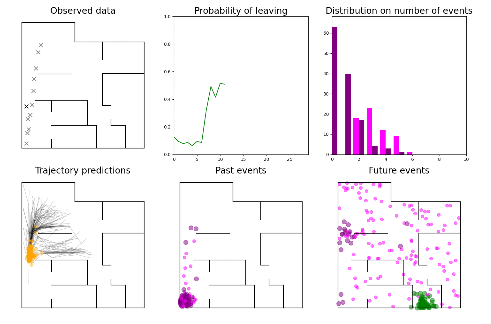
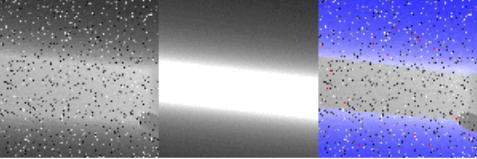
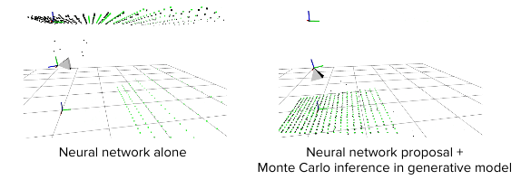
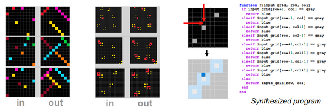
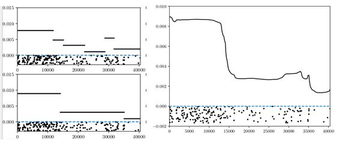
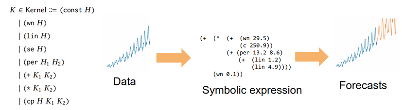

---
---

# What is Gen?

Probabilistic modeling and inference are core tools in diverse fields including statistics, machine learning, computer vision, cognitive science, robotics, natural language processing, and artificial intelligence.
To meet the functional requirements of applications, practitioners use a broad range of modeling techniques and approximate inference algorithms.
However, implementing inference algorithms is often difficult and error prone.
Gen simplifies the use of probabilistic modeling and inference, by providing *modeling languages* in which users express models, and high-level programming constructs that automate aspects of inference.

Like some probabilistic programming research languages, Gen includes *universal* modeling languages that can represent any model, including models with stochastic structure, discrete and continuous random variables, and simulators.
However, Gen is distinguished by the flexibility that it affords to users for customizing their inference algorithm.
It is possible to use built-in algorithms that require only a couple lines of code, as well as develop custom algorithms that are more able to meet scalability and efficiency requirements.

Gen's flexible modeling and inference programming capabilities unify symbolic, neural, probabilistic, and simulation-based approaches to modeling and inference, including causal modeling, symbolic programming, deep learning, hierarchical Bayesian modeling, graphics and physics engines, and planning and reinforcement learning.

Gen is a package for the [Julia](https://julialang.org/) programming language.
Gen consists of multiple modeling languages that are implemented as DSLs in Julia and a Julia library for inference programming.

# What can Gen be used for?

<div class="row">
  <div class="col-md-6">
  
  </div>
  <div class="col-md-6">
<p><b>Interpreting and predicting human behavior</b></p>
Inferring the goals and predicting future trajectories of a human walking around a floor-plan from noisy locations measurements. A theory-of-mind generative model of the humans' motion posits an unbounded number of events. Inference is based on sequential Monte Carlo inference using rejuvenation MCMC moves based on a cycle of a custom reversible jump scheme, coarse-to-fine inference, and data-driven proposals.
  </div>
</div>

<hr>

<div class="row">
  <div class="col-md-6">
<b>Tracking the pose of a camera from depth data.</b>
The pose of a depth camera is tracked via a neural network and a hybrid approach combining a neural network and model-based reasoning. The pure neural network inference algorithm is inaccurate on out-of-distribution data, while the hybrid inference algorithm remains accurate.
  </div>
  <div class="col-md-6">
  
  
  </div>
</div>

<hr>

<div class="row">
  <div class="col-md-6">
  
  </div>
  <div class="col-md-6">
<b>Program synthesis.</b>
Given input-output examples, infer a program that maps inputs to outputs via Bayesian inference over the space of possible programs. The inference algorithm is based on sequential Monte Carlo.
  </div>
</div>

<hr>

<div class="row">
  <div class="col-md-6">
<b>Changepoint modeling of time series.</b>
Reversible-jump MCMC inference in a piecewise-homogeneous poisson process model of coal mining disaster events, with an unknown number of changepoints.
  </div>
  <div class="col-md-6">
  
  </div>
</div>

<hr>

<div class="row">
  <div class="col-md-6">
<b>GP structure learning.</b>
Bayesian inference over a compositional space of Gaussian process covariance functions expressed in a domain-specific symbolic expression langugae.
  </div>
  <div class="col-md-6">
  
  </div>
</div>

# Getting Started

*Warning: Gen is rapidly evolving pre-alpha research software.*

## Using Julia package manager
First, [download Julia 1.0 or later](https://julialang.org/downloads/).

The, install the Gen package with the Julia package manager.
From the Julia REPL, type `]` to enter the Pkg REPL mode and then run:
```
pkg> add https://github.com/probcomp/Gen
```
## Docker

A docker image containing an installation of Gen, with tutorial Jupyter notebooks, is available [here](https://github.com/probcomp/gen-quickstart). 

# Benchmarks

Code for benchmarks, presented at PLDI 2019, are available [here](https://github.com/probcomp/pldi2019-gen-experiments).

# Publications

Gen: A General-Purpose Probabilistic Programming System with Programmable Inference. Cusumano-Towner, M. F.; Saad, F. A.; Lew, A.; and Mansinghka, V. K. In Proceedings of the 40th ACM SIGPLAN Conference on Programming Language Design and Implementation (PLDI '19). [URL](https://dl.acm.org/citation.cfm?id=3314642)

Incremental inference for probabilistic programs. Cusumano-Towner, M. F.; Bichsel, B.; Gehr, T.; Vechev, M.; and Mansinghka, V. K. In Proceedings of the 39th ACM SIGPLAN Conference on Programming Language Design and Implementation (PLDI), pages 571–585. ACM, 2018. [URL](https://dl.acm.org/citation.cfm?id=3192399).

A design proposal for Gen: Probabilistic programming with fast custom inference via code generation. Cusumano-Towner, M. F.; and Mansinghka, V. K. In Workshop on Machine Learning and Programming Languages (MAPL, co-located with PLDI), pages 52–57. 2018. [URL](https://dl.acm.org/citation.cfm?id=3211350).

Using probabilistic programs as proposals. Cusumano-Towner, M. F.; and Mansinghka, V. K. In Workshop on Probabilistic Programming Languages, Semantics, and Systems (PPS, co-located with POPL). 2018. [URL](https://arxiv.org/pdf/1801.03612.pdf).

Encapsulating models and approximate inference programs in probabilistic modules. Cusumano-Towner, M. F.; and Mansinghka, V. K. In Workshop on Probabilistic Programming Semantics (PPS, co-located with POPL). 2017. [URL](https://arxiv.org/pdf/1612.04759.pdf).

# Getting in Contact

Gen was created at the [MIT Probabilstic Computing Project](http://probcomp.csail.mit.edu/). To get in contact with the Project, please fill out this [online form](https://docs.google.com/forms/d/e/1FAIpQLSfbPY5e0KMVEFg7tjVUsOsKy5tWV9Moml3dPkDPXvP8-TSMNA/viewform?usp=sf_link). (But please don't hesitate to engage directly with the Gen open source project via the Github site!)

# Citing
To cite Gen, please use:
```
@inproceedings{Cusumano-Towner:2019:GGP:3314221.3314642,
 author = {Cusumano-Towner, Marco F. and Saad, Feras A. and Lew, Alexander K. and Mansinghka, Vikash K.},
 title = {Gen: A General-purpose Probabilistic Programming System with Programmable Inference},
 booktitle = {Proceedings of the 40th ACM SIGPLAN Conference on Programming Language Design and Implementation},
 series = {PLDI 2019},
 year = {2019},
 isbn = {978-1-4503-6712-7},
 location = {Phoenix, AZ, USA},
 pages = {221--236},
 numpages = {16},
 url = {http://doi.acm.org/10.1145/3314221.3314642},
 doi = {10.1145/3314221.3314642},
 acmid = {3314642},
 publisher = {ACM},
 address = {New York, NY, USA},
 keywords = {Markov chain Monte Carlo, Probabilistic programming, sequential Monte Carlo, variational inference},
} 
```
