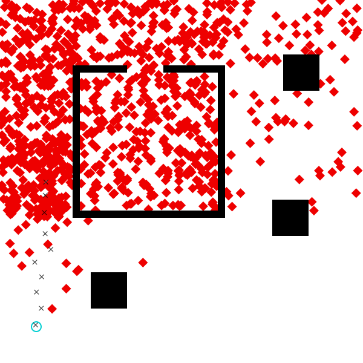

# Tutorial: Data-Driven Proposals in Gen _(with applications to Inverse Planning)_


### What is this tutorial about?

In our 
[introduction to modeling tutorial](../intro-to-modeling/tutorial), we used **Importance Sampling** for inference: the inference engine _proposed_ many possible explanations for a dataset, and then chose one. Importance sampling can be difficult to scale to more complex problems, because it is essentially "guessing and checking." If we ran importance sampling with 1000 particles, for example, 
the method would fail unless those 1000 proposed solutions (blind guesses, essentially)
contained _something_ close to the true answer. In complex problems, it is difficult
to "guess" (or "propose") an entire solution all at once.

This tutorial addresses the scalability problem while staying inside
the importance sampling framework: the inference in this notebook is all importance
sampling, but with **customized "data-driven" proposals**. Such proposals 
can be used to accelerate Monte Carlo inference, making importance sampling
feasible for a broader class of models. Data-driven proposals work by incorporating 
information from the observed data set to make better proposals for the 
latent variables in a generative model. Data-driven proposals can be based on heuristics,
or general-purpose _discriminative_ models, such as neural networks or random forests.
Many data-driven proposals have **trainable parameters**, which can be learned via gradient
descent using synthetic data simulated from the generative model itself. This training
process is sometimes called 'amortized inference' or 'inference compilation'.

Although we focus on using data-driven proposals with importance sampling in this notebok,
data-driven proposals can also be used with Markov Chain Monte Carlo (MCMC) and
sequential Monte Carlo (SMC), covered in [other](../iterative-inference/tutorial) [tutorials](../particle-filtering/tutorial).

### Application to Inverse Planning
This notebook begins by introducing a probabilistic model for the motion of 
an autonomous agent. The model itself demonstrates an important feature of
Gen: because it is embedded in Julia, we can use complex, black-box programs
as sub-routines in our models. The model we develop here uses an _RRT path planner_
to model the goal-directed motion of the agent.

After developing the model, we set out to improve the efficiency of inference. 
We show that we can improve the efficiency of inference in this model using
a custom proposal for the destination of the agent.

## Outline

**Section 1.** [A generative model of an autonomous agent](#model)

**Section 2.** [Writing a data-driven proposal as a generative function](#custom-proposal)

**Section 3.** [Using a data-driven proposal within importance sampling](#using)

**Section 4.** [Training the parameters of a data-driven proposal](#training)


```julia
# This cell will take a few seconds to run.
using Gen, Distributions
```

## 1: A generative model of an autonomous agent   <a name="model"></a>

We begin by writing a generative probabilistic model of the motion of an
intelligent agent that is navigating a two-dimensional scene. The model will
be *algorithmic* --- it will invoke a path planning algorithm implemented in
regular Julia code to generate the agent's motion plan from its destination
and its map of the scene.

First, we load some basic geometric primitives for a two-dimensional scene. We
implemented these already in an auxiliary Julia file:


```julia
include("../inverse-planning/geometric_primitives.jl");
```

This file imports a two-dimensional `Point` data type with fields `x` and `y`:


```julia
point = Point(1.0, 2.0)
println(point.x)
println(point.y)
```

    1.0
    2.0


The file also defines an `Obstacle` data type, which represents a polygonal
obstacle in a two-dimensional scene, that is constructed from a list of
vertices. Here, we construct a square:


```julia
obstacle = Obstacle([Point(0.0, 0.0), Point(1.0, 0.0), Point(0.0, 1.0), Point(1.0, 1.0)]);
```

Next, we load the definition of a `Scene` data type that represents a
two-dimensional scene.


```julia
include("../inverse-planning/scene.jl");
```

The scene spans a rectangle of on the two-dimensional x-y plane, and contains
a list of obstacles, which is initially empty:


```julia
scene = Scene(xmin=0, xmax=1, ymin=0, ymax=1)
```


    Scene(0.0, 1.0, 0.0, 1.0, Obstacle[])


Obstacles are added to the scene with the `add_obstacle!` function:


```julia
add_obstacle!(scene, obstacle);
```

The file also defines functions that simplify the construction of obstacles:

`make_square(center::Point, size::Float64)` constructs a square-shaped
obstacle centered at the given point with the given side length:


```julia
obstacle = make_square(Point(0.30, 0.20), 0.1)
```


    Obstacle(Point[Point(0.25, 0.15000000000000002), Point(0.35, 0.15000000000000002), Point(0.35, 0.25), Point(0.25, 0.25)])


`make_line(vertical::Bool, start::Point, length::Float64,
thickness::Float64)` constructs an axis-aligned line (either vertical or
horizontal) with given thickness that extends from a given strating point for
a certain length:


```julia
obstacle = make_line(false, Point(0.20, 0.40), 0.40, 0.02)
```


    Obstacle(Point[Point(0.2, 0.4), Point(0.6000000000000001, 0.4), Point(0.6000000000000001, 0.42000000000000004), Point(0.2, 0.42000000000000004)])


We now construct a scene value that we will use in the rest of the notebook:


```julia
scene = Scene(xmin=0, xmax=1, ymin=0, ymax=1)
add_obstacle!(scene, make_square(Point(0.30, 0.20), 0.1))
add_obstacle!(scene, make_square(Point(0.83, 0.80), 0.1))
add_obstacle!(scene, make_square(Point(0.80, 0.40), 0.1))
horizontal = false
vertical = true
wall_thickness = 0.02
add_obstacle!(scene, make_line(horizontal, Point(0.20, 0.40), 0.40, wall_thickness))
add_obstacle!(scene, make_line(vertical, Point(0.60, 0.40), 0.40, wall_thickness))
add_obstacle!(scene, make_line(horizontal, Point(0.60 - 0.15, 0.80), 0.15 + wall_thickness, wall_thickness))
add_obstacle!(scene, make_line(horizontal, Point(0.20, 0.80), 0.15, wall_thickness))
add_obstacle!(scene, make_line(vertical, Point(0.20, 0.40), 0.40, wall_thickness));
```


```julia
# We visualize the scene below.
include("../inverse-planning/viz.jl")
visualize() do 
    draw_scene(scene) 
end
```


    

    


Next, we load a file that defines a `Path` data type (a sequence of
`Point`s), and a `plan_path` method, which  uses a path planning algorithm
based on rapidly exploring random tree (RRT, [1]) to find a sequence of
`Point`s beginning with `start` and ending in `dest` such that the line
segment between each consecutive pair of points does not intersect any
obstacles in the scene. The planning algorithm may fail to find a valid path,
in which case it will return a value of type `Nothing`.

`path::Union{Path,Nothing} = plan_path(start::Point, dest::Point,
scene::Scene, planner_params::PlannerParams)`

[1] [_Rapidly-exploring random trees: A new tool for path planning._](http://citeseerx.ist.psu.edu/viewdoc/download?doi=10.1.1.35.1853&rep=rep1&type=pdf)
S. M. LaValle. TR 98-11, Computer Science Dept., Iowa State University, October 1998.


```julia
include("../inverse-planning/planning.jl");
```

Let's use `plan_path` to plan a path from the lower-left corner of the scene
into the interior of the box.


```julia
start = Point(0.1, 0.1)
dest = Point(0.5, 0.5)
planner_params = PlannerParams(rrt_iters=300, rrt_dt=3.0,
                               refine_iters=3500, refine_std=1.)
path = plan_path(start, dest, scene, planner_params)
```


    Path(Point[Point(0.1, 0.1), Point(0.1253515594394693, 0.5164009936873899), Point(0.11095631971418911, 0.796900695279408), Point(0.30941512351219613, 0.8730219251057317), Point(0.3710285496975634, 0.8112721899208615), Point(0.5, 0.5)])


We visualize the path below. The start location is shown in blue, the
destination in red, and the path in orange. Run the cell above followed by
the cell below a few times to see the variability in the paths generated by
`plan_path` for these inputs.


```julia
visualize() do 
    draw_trace(Dict(:start => start, :dest => dest, :scene => scene, :path => path.points); should_draw_measurements=false)
end
```


    

    


We also need a model for how the agent moves along its path.
We will assume that the agent moves along its path a constant speed. The file
loaded above also defines a method (`walk_path`) that computes the locations
of the agent at a set of timepoints (sampled at time intervals of `dt`
starting at time `0.`), given the path and the speed of the agent:

`locations::Vector{Point} =  walk_path(path::Path, speed::Float64,
dt::Float64, num_ticks::Int)`


```julia
speed = 1.
dt = 0.1
num_ticks = 10;
locations = walk_path(path, speed, dt, num_ticks)
println(locations)
```

    Point[Point(0.1, 0.1), Point(0.10607700387369604, 0.19981517932618803), Point(0.11215400774739206, 0.29963035865237614), Point(0.1182310116210881, 0.39944553797856425), Point(0.12430801549478411, 0.4992607173047523), Point(0.12110641528138277, 0.5991201211408362), Point(0.11598116190558816, 0.6989886936640975), Point(0.11278552471025023, 0.7976023085676063), Point(0.20615300301971937, 0.8334145131092261), Point(0.2995204813291885, 0.8692267176508457)]


Now, we are prepated to write our generative model for the motion of the agent.


```julia
@gen function agent_model(
        scene::Scene, dt::Float64, num_ticks::Int, 
        planner_params::PlannerParams)

    # sample the start point of the agent from the prior
    start_x ~ uniform(0, 1)
    start_y ~ uniform(0, 1)
    start = Point(start_x, start_y)

    # sample the destination point of the agent from the prior
    dest_x ~ uniform(0, 1)
    dest_y ~ uniform(0, 1)
    dest = Point(dest_x, dest_y)

    # plan a path that avoids obstacles in the scene
    maybe_path = plan_path(start, dest, scene, planner_params)
    planning_failed = maybe_path === nothing
    
    # sample the speed from the prior
    speed ~ uniform(0.3, 1)

    if planning_failed   
        # path planning failed; assume agent stays at start location indefinitely
        locations = fill(start, num_ticks)
    else   
        # path planning succeeded; move along the path at constant speed
        locations = walk_path(maybe_path, speed, dt, num_ticks)
    end

    # generate noisy measurements of the agent's location at each time point
    noise = 0.01
    for (i, point) in enumerate(locations)
        x = {:meas => (i, :x)} ~ normal(point.x, noise)
        y = {:meas => (i, :y)} ~ normal(point.y, noise)
    end

    return (planning_failed, maybe_path)
end;
```

We can now perform a traced execution of `agent_model` and print out the
random choices it made:

### Exercise

Using `simulate` (or `generate`, without any constraints) to sample a trace,
print the random choices made by this model. Parameterize the planner using
`PlannerParams` with the same parameters as above.

<!-- # BEGIN ANSWER KEY 2A.1

planner_params = PlannerParams(rrt_iters=300, rrt_dt=3.0,
                               refine_iters=2000, refine_std=1.)
trace = Gen.simulate(agent_model, (scene, dt, num_ticks, planner_params));
choices = Gen.get_choices(trace)
display(choices)

# END ANSWER KEY -->
<hr>

Next we explore the assumptions of the model by sampling many traces from the
generative function and visualizing them. We have created a specialized visualization
for traces of this generative function:


```julia
# Let's visualize several traces of the function, with the start location fixed to
# a point in the lower-left corner:
constraints = Gen.choicemap()
constraints[:start_x] = 0.1
constraints[:start_y] = 0.1

traces = [Gen.generate(agent_model, (scene, dt, num_ticks, planner_params), constraints)[1] for i in 1:12];
visualize_grid(traces, 4, 600; separators="gray") do trace, frame
    draw_trace(trace, frame; draw_measurements=true, markersize=6)
end
```


    

    


In this visualization, the start location is represented by a blue dot, and
the destination is represented by a red dot. The measured coordinates at each
time point are represented by black dots. The path, if path planning was
succesful, is shown as a gray line from the start point to the destination
point. Notice that the speed of the agent is different in each case. Also note that
the we observe the agent for a fixed amount of time, in which they may or may not
finish walking their planned path.

<hr>

### Exercise

Edit the constraints passed to the inference algorithm:

1. Constrain the start of the agent to be at $x = 0.9$, $y = 0.1$.
2. Constrain the destination of the agent to be at $x = 0.9$, $y = 0.8$.


Visualize the resulting prior. We have provided some starter code.


```julia
# < put your code here>
traces_constrained = []
for i in 1:12
    # Modify the following line:
    (trace_constrained, _) = Gen.generate(agent_model, (scene, dt, num_ticks, planner_params))
    push!(traces_constrained, trace_constrained)
end

# Visualize:
visualize_grid(traces_constrained, 4, 600; separators="gray") do trace, frame
    draw_trace(trace, frame; draw_measurements=true)
end
```


    

    


<!-- # BEGIN ANSWER KEY 2A.2

constraints = Gen.choicemap()
constraints[:start_x] = 0.9
constraints[:start_y] = 0.1

constraints[:dest_x] = 0.9
constraints[:dest_y] = 0.8

traces_constrained = []
for i in 1:12
    # Modify the following line:
    (trace_constrained, _) = Gen.generate(agent_model, (scene, dt, num_ticks, planner_params), constraints)
    push!(traces_constrained, trace_constrained)
end

# Visualize:
visualize_grid(traces_constrained, 4, 600; separators="gray") do trace, frame
    draw_trace(trace, frame; draw_measurements=true)
end

# END ANSWER KEY -->
<hr>

### Exercise
The `rrt_iters` field of `PlannerParams` is the number of iterations of the RRT
algorithm to use. The `refine_iters` field of `PlannerParams` is the number of
iterations of path refinement. These parameters affect the distribution on
paths of the agent. Visualize traces of the `agent_model` with a couple of
different settings of these two parameters to the path planning algorithm for
fixed starting point and destination point. Try setting them to smaller
values. Discuss.

We have provided starter code.


```julia
constraints = Gen.choicemap()
constraints[:start_x] = 0.1
constraints[:start_y] = 0.1;
```

Modify the `PlannerParams` in the cell below.


```julia
planner_params = PlannerParams(rrt_iters=300, rrt_dt=3.0, refine_iters=2000, refine_std=1.) # < change this line>

traces = [Gen.generate(agent_model, (scene, dt, num_ticks, planner_params), constraints)[1] for i in 1:12];
visualize_grid(traces, 4, 600; separators="gray") do trace, frame 
    draw_trace(trace, frame; draw_measurements=true)
end
```


    

    


<hr>

For the next few sections of the notebook, let's reset any variables that may have changed during your exploration with the model.


```julia
start = Point(0.1, 0.1)
dt = 0.1
num_ticks = 10
planner_params = PlannerParams(rrt_iters=600, rrt_dt=0.05,
                               refine_iters=3500, refine_std=1.);
```

We will infer the destination of the agent for the given sequence of observed locations:


```julia
measurements = [
    Point(0.0980245, 0.104775),
    Point(0.113734, 0.150773),
    Point(0.100412, 0.195499),
    Point(0.114794, 0.237386),
    Point(0.0957668, 0.277711),
    Point(0.140181, 0.31304),
    Point(0.124384, 0.356242),
    Point(0.122272, 0.414463),
    Point(0.124597, 0.462056),
    Point(0.126227, 0.498338)];
```

<hr>

### Exercise

Run inference using Gen's built-in importance resampling implementation. Use
50 importance samples (`amt_computation`). 

To see how to use the built-in importance resampling function, run
```?Gen.importance_resampling``` or check out the
[documentation](https://www.gen.dev/docs/dev/ref/importance/#Gen.importance_resampling).

We have provided some starter code.


```julia
function do_inference(
        scene::Scene, dt::Float64, num_ticks::Int, 
        planner_params::PlannerParams, 
        start::Point, measurements::Vector{Point}, amount_of_computation::Int)
    
    # Constrain the observed measurements.
    observations = Gen.choicemap()
    observations[:start_x] = start.x
    observations[:start_y] = start.y
    for (i, m) in enumerate(measurements)
        observations[:meas => (i, :x)] = m.x
        observations[:meas => (i, :y)] = m.y
    end
    
    # < put your code here>
    
    return trace
end;
```

<!-- # BEGIN ANSWER KEY 2A.3

function do_inference(
        scene::Scene, dt::Float64, num_ticks::Int, 
        planner_params::PlannerParams, 
        start::Point, measurements::Vector{Point}, amount_of_computation::Int)
    
    # Constrain the observed measurements.
    observations = Gen.choicemap()
    observations[:start_x] = start.x
    observations[:start_y] = start.y
    for (i, m) in enumerate(measurements)
        observations[:meas => (i, :x)] = m.x
        observations[:meas => (i, :y)] = m.y
    end
    
    # Call importance_resampling to obtain a likely trace consistent
    # with our observations.
    (trace, _) = Gen.importance_resampling(
        agent_model, (scene, dt, num_ticks, planner_params),
        observations, amount_of_computation)
    
    return trace
end;

# END ANSWER KEY -->
#### Visualize your answer
Below, we run this algorithm 1000 times, to generate 1000 approximate samples
from the posterior distribution on the destination. The inferred destinations
should appear as red dots on the map. First, we abstract this into a
function.


```julia
function visualize_inference(measurements, scene, start; computation_amt=50, samples=1000)
    visualize() do
        for i in 1:samples
            trace = do_inference(scene, dt, num_ticks, planner_params, start, measurements, computation_amt)
            draw_trace(trace; draw_measurements=true, draw_path=false)
        end
    end
end;
```


And now we run it! Note that this might take a while.


```julia
visualize_inference(measurements, scene, start, computation_amt=50, samples=500)
```


    

    


The algorithm has made reasonable inferences about where the agent was likely
trying to go.

Note that the above illustration takes a while to produce. This is
because each dot requires sampling 50 times from the default proposal (which
runs the RRT planner). When our models contain more expensive components, like
the path-planner, the computational demands of inference increase accordingly.
This motivates us to find more efficient inference algorithms, that will
require fewer model evaluations to produce good results.

<hr>

### Exercise

In this problem, you'll explore the effect of changing the _scene_ on the
inferences we make about the agent. Below, we've reproduced the code for
constructing the scene in which we performed inference above. Modify the scene
so that there is an opening into the "room" along the _bottom_ wall, in
addition to the already-existing door along top wall. Otherwise, the scene
should be identical to the one above.

Rerun inference. The results should be qualitatively different from the
results generated above, even though the observed movements of the agent are
identical. **Write a one- or two-sentence description of how the results are
different, and why.** Please address:

1. Why would a _human_ make different inferences about the agent's likely
   destination in the two different scenes?
2. To what extent does the _model_ succeed in producing qualitiatively
   different results in the two scenes? Why? (Concretely, why are certain
   proposals more often rejected by importance sampling in the two-door scene
   than in the one-door scene?)


```julia
scene_2doors = Scene(xmin=0, xmax=1, ymin=0, ymax=1)

# Add the three blocks.
add_obstacle!(scene_2doors, make_square(Point(0.30, 0.20), 0.1))
add_obstacle!(scene_2doors, make_square(Point(0.83, 0.80), 0.1))
add_obstacle!(scene_2doors, make_square(Point(0.80, 0.40), 0.1))

# Add the walls. You will need to change this code. In particular, you will need to edit 
# one of these lines (the one that constructs the bottom wall of the room) and add one new line
# (because in order to create the "door", you will actually need to represent the bottom wall
# as two separate rectangular obstacles -- as the sample code already does for the top wall).
horizontal = false
vertical = true
wall_thickness = 0.02
add_obstacle!(scene_2doors, make_line(horizontal, Point(0.20, 0.40), 0.40, wall_thickness))
add_obstacle!(scene_2doors, make_line(vertical, Point(0.60, 0.40), 0.40, wall_thickness))
add_obstacle!(scene_2doors, make_line(horizontal, Point(0.60 - 0.15, 0.80), 0.15 + wall_thickness, wall_thickness))
add_obstacle!(scene_2doors, make_line(horizontal, Point(0.20, 0.80), 0.15, wall_thickness))
add_obstacle!(scene_2doors, make_line(vertical, Point(0.20, 0.40), 0.40, wall_thickness));
```


```julia
# Perform and visualize inference:
visualize_inference(measurements, scene_2doors, start, computation_amt=100, samples=500)
```


    

    


**Free response:** What changed about the inferences when you changed the scene,
and why? You might address:

1. Why would a _human_ make different inferences about the agent's likely
   destination in the two different scenes?
2. To what extent does the _model_ succeed in producing qualitiatively
   different results in the two scenes? (Concretely, why are certain proposals
   more often rejected by importance sampling in the two-door scene than in
   the one-door scene?)

<hr>
<!-- # BEGIN ANSWER KEY 2.4

scene_2doors = Scene(xmin=0, xmax=1, ymin=0, ymax=1)

# Add the three blocks.
add_obstacle!(scene_2doors, make_square(Point(0.30, 0.20), 0.1))
add_obstacle!(scene_2doors, make_square(Point(0.83, 0.80), 0.1))
add_obstacle!(scene_2doors, make_square(Point(0.80, 0.40), 0.1))

horizontal = false
vertical = true
wall_thickness = 0.02
add_obstacle!(scene_2doors, make_line(horizontal, Point(0.60 - 0.15, 0.40), 0.15 + wall_thickness, wall_thickness))
add_obstacle!(scene_2doors, make_line(horizontal, Point(0.20, 0.40), 0.15, wall_thickness))
add_obstacle!(scene_2doors, make_line(vertical, Point(0.60, 0.40), 0.40, wall_thickness))
add_obstacle!(scene_2doors, make_line(horizontal, Point(0.60 - 0.15, 0.80), 0.15 + wall_thickness, wall_thickness))
add_obstacle!(scene_2doors, make_line(horizontal, Point(0.20, 0.80), 0.15, wall_thickness))
add_obstacle!(scene_2doors, make_line(vertical, Point(0.20, 0.40), 0.40, wall_thickness))

# Perform and visualize inference:
visualize_inference(measurements, scene_2doors, start, computation_amt=50, samples=100)

# END ANSWER KEY -->

## 2. Writing a data-driven proposal as a generative function <a name="custom-proposal"></a>

The inference algorithm above used a variant of
[`Gen.importance_resampling`](https://www.gen.dev/docs/stable/ref/importance/#Gen.importance_resampling)
that does not take a custom proposal distribution. It uses the default
proposal distribution associated with the generative model. For generative
functions defined using the built-in modeling DSL, the default proposal
distribution is based on *ancestral sampling*, which involves sampling
unconstrained random choices from the distributions specified in the
generative model. Put more simply, each "guess" the inference algorithm
makes about the possible destination of the agent is totally uninformed
by the observed measurements; it is sampled using the prior generative
model's `dest_x` and `dest_y` sampling statements.

We can visualize this default proposal distribution by sampling from it, 
using `Gen.generate` (note, we also could use `Gen.simulate` for the same purpose, since we are not passing any constraints). The cell below shows samples of the agent's destination 
drawn from this distribution.


```julia
include("../inverse-planning/viz.jl");

traces = [Gen.generate(agent_model, (scene, dt, num_ticks, planner_params))[1] for i in 1:1000]
visualize() do

    for i in 1:1000
        trace, = Gen.generate(agent_model, (scene, dt, num_ticks, planner_params))
        draw_dest(scene, Point(trace[:dest_x], trace[:dest_y]))
    end

    draw_scene(scene)
    draw_start(scene, start)
    draw_measurements(scene, measurements)
end
```


    

    


Intuitively, if we see the data set above (where blue is the starting
location, and the measurements are black crosses), we might guess that the 
agent is more likely to be heading into the upper part of the scene. This 
is because we don't expect the agent to unecessarily backtrack on its route
to its destnation. A simple heuristic for biasing the proposal distribution 
of the destination using just the first measurement and the last measurement might be:

- If the x-coordinate of the last measurement is greater than the
  x-coordinate of the first measurement, we think the agent is probably
  headed generally to the right. Make values `:dest_x` that are greater than
  the x-coordinate of the last measurement more probable.

- If the x-coordinate of the last measurment is less than the x-coordinate of
  the first measurement, we think the agent is probably headed generally to
  the left. Make values  `:dest_x` that are smaller than the x-coordinate of
  the last measurement more probable.

We can apply the same heuristic separately for the y-coordinate.

To implement this idea, we discretize the x-axis and y-axis of the scene into
bins:


```julia
num_x_bins = 5
num_y_bins = 5;
```

We will propose the x-coordinate of the destination from a
[piecewise_uniform](https://www.gen.dev/docs/dev/ref/distributions/#Gen.piecewise_uniform)
distribution, where we set higher probability for certain bins based on the
heuristic described above and use a uniform continuous distribution for the
coordinate within a bin. The `compute_bin_probs` function below computes the
probability for each bin. The bounds of the scene are given by `min` and
`max`. The coordinates of the first and last measured points respectively are
given by `first` and `last`. We compute the probability by assigning a
"score" to each bin based on the heuristic above --- if the bin should
receive lower probability, it gets a score of 1., and if it should receive
higher probability, it gets a bin of `score_high`, where `score_high` is some
value greater than 1.


```julia
function compute_bin_prob(first::Float64, last::Float64, bin::Int, last_bin::Int, score_high)
    last >= first && bin >= last_bin && return score_high
    last < first && bin <= last_bin && return score_high
    return 1.
end

function compute_bin_probs(num_bins::Int, min::Float64, max::Float64, first::Float64, last::Float64, score_high)
    bin_len = (max - min) / num_bins
    last_bin = Int(floor(last / bin_len)) + 1
    probs = [compute_bin_prob(first, last, bin, last_bin, score_high) for bin=1:num_bins]
    total = sum(probs)
    return [p / total for p in probs]
end;
```

We will see how to automatically tune the value of `score_high` shortly. For
now, we will use a value of 5. Below, we see that for the data set of
measurements, shown above the probabilities of higher bins are indeed 5x
larger than those of lower bins, becuase the agent seems to be headed up.


```julia
compute_bin_probs(num_y_bins, scene.ymin, scene.ymax, measurements[1].y, measurements[end].y, 5.)
```


    5-element Vector{Float64}:
     0.058823529411764705
     0.058823529411764705
     0.29411764705882354
     0.29411764705882354
     0.29411764705882354


Next, we write a generative function that applies this heuristic for both the
x-coordinate and y-coordinate, and samples the destination coordinates at
addresses `:dest_x` and `:dest_y`.


```julia
@gen function custom_dest_proposal(measurements::Vector{Point}, scene::Scene)

    score_high = 5.
    
    x_first = measurements[1].x
    x_last = measurements[end].x
    y_first = measurements[1].y
    y_last = measurements[end].y
    
    # sample dest_x
    x_probs = compute_bin_probs(num_x_bins, scene.xmin, scene.xmax, x_first, x_last, score_high)
    x_bounds = collect(range(scene.xmin, stop=scene.xmax, length=num_x_bins+1))
    dest_x ~ piecewise_uniform(x_bounds, x_probs)
    
    # sample dest_y
    y_probs = compute_bin_probs(num_y_bins, scene.ymin, scene.ymax, y_first, y_last, score_high)
    y_bounds = collect(range(scene.ymin, stop=scene.ymax, length=num_y_bins+1))
    dest_y ~ piecewise_uniform(y_bounds, y_probs)
    
    return nothing
end;
```

We can propose values of random choices from the proposal function using
[`Gen.propose`](https://www.gen.dev/docs/stable/ref/gfi/#Gen.propose).
This method returns the choices, as well as some other information, which we
won't need for our purposes. For now, you can think of `Gen.propose` as
similar to `Gen.generate` except that it does not produce a full execution
trace (only the choices), and it does not accept constraints. We can see the
random choices for one run of the proposal on our data set:


```julia
(proposed_choices, _, _) = Gen.propose(custom_dest_proposal, (measurements, scene))
proposed_choices
```


    │
    ├── :dest_y : 0.5004991033166655
    │
    └── :dest_x : 0.9394799919113345


The function below runs the proposal 1000 times. For each run, it generates a
trace of the model where the `:dest_x` and `:dest_y` choices are constrained
to the proposed values, and then visualizes the resulting traces. We make the
proposal a parameter of the function because we will be visualizing the
output distribution of various proposals later in the notebook.


```julia
function visualize_custom_destination_proposal(measurements, start, dest_proposal; num_samples=100)
    visualize() do 
        for i=1:num_samples
            (proposed_choices, _) = Gen.propose(dest_proposal, (measurements, scene))
            constraints = choicemap(proposed_choices)
            constraints[:start_x] = start.x
            constraints[:start_y] = start.y
            (trace, _) = Gen.generate(agent_model, (scene, dt, num_ticks, planner_params), constraints)
            draw_dest(scene, Point(trace[:dest_x], trace[:dest_y]))
        end
        draw_scene(scene)
        draw_start(scene, start)
        draw_measurements(scene, measurements)
    end
end;
```

Let's visualize the output distribution of `custom_dest_proposal` for our
data set:


```julia
visualize_custom_destination_proposal(measurements, start, custom_dest_proposal, num_samples=1000)
```


    

    


We see that the proposal distribution indeed samples destinations in the top
half of the scene with higher probability than destinations in the bottom
half.

Alone, this is just a heuristic. But we can use it as a proposal for importance sampling, turning it into an asymptotically valid Bayesian inference algorithm. Alternatively, we can view it as a tool for speeding up our naive importance sampler, by focusing computation on regions of the space that are more likely.

## 3. Using a data-driven proposal within importance sampling <a name="using"></a>

We now use our data-driven proposal within an inference algorithm. There is a
second variant of
[`Gen.importance_resampling`](https://www.gen.dev/docs/stable/ref/importance/#Gen.importance_resampling)
that accepts a generative function representing a custom proposal. This
proposal generative function makes traced random choices at the addresses of
a subset of the unobserved random choices made by the generative model. In
our case, these addresses are `:dest_x` and `:dest_y`.

<hr>

### Exercise

Implement an inference program that uses this second variant of importance resampling. 


Because we will experiment with different data-driven proposals, we make the
proposal into an agument of our inference program. We assume that the
proposal accepts arguments `(measurements, scene)`.

This time, use only 5 importance samples (`amt_computation`). You can run
`?Gen.importance_resampling` or check out the
[documentation](https://www.gen.dev/docs/stable/ref/inference/#Importance-Sampling-1)
to understand how to supply the arguments to invoke this second version of of
importance resampling.

We have provided some starter code.


```julia
function do_inference_data_driven(
        dest_proposal::GenerativeFunction,
        scene::Scene, dt::Float64,
        num_ticks::Int, planner_params::PlannerParams,
        start::Point, measurements::Vector{Point}, 
        amount_of_computation::Int)
    
    observations = Gen.choicemap((:start_x, start.x), (:start_y, start.y))
    for (i, m) in enumerate(measurements)
        observations[:meas => (i, :x)] = m.x
        observations[:meas => (i, :y)] = m.y
    end
    
    # < put your code here>
    
    return trace
end;

function visualize_data_driven_inference(measurements, scene, start, proposal; amt_computation=50, samples=1000)
    visualize() do 
      for i=1:samples
          trace = do_inference_data_driven(proposal, 
              scene, dt, num_ticks, planner_params, start, measurements, amt_computation)
          draw_trace(trace; draw_path=false)
      end
    end
end;
```


```julia
visualize_data_driven_inference(measurements, scene, start, custom_dest_proposal; amt_computation=5, samples=1000)
```


    

    


The code executes much more quickly than before, because we are only taking five proposal samples to generate each.

We compare this to the original algorithm that used the default proposal, for
the same "amount of computation" of 5.


```julia
visualize_inference(measurements, scene, start, computation_amt=5, samples=1000)
```


    

    


We should see that the results are somewhat more accurate using the
data-driven proposal.  In particular, there is less probability mass in the
lower left corner when using the data-driven proposal.

<hr>

<!-- # BEGIN ANSWER KEY 2A.5

function do_inference_data_driven(
        dest_proposal::GenerativeFunction,
        scene::Scene, dt::Float64,
        num_ticks::Int, planner_params::PlannerParams,
        start::Point, measurements::Vector{Point}, 
        amount_of_computation::Int)
    
    observations = Gen.choicemap((:start_x, start.x), (:start_y, start.y))
    for (i, m) in enumerate(measurements)
        observations[:meas => (i, :x)] = m.x
        observations[:meas => (i, :y)] = m.y
    end
    
    # invoke the variant of importance_resampling 
    # that accepts a custom proposal (dest_proposal).
    # the arguments to the custom proposal are (measurements, scene)
    (trace, _) = Gen.importance_resampling(agent_model, (scene, dt, num_ticks, planner_params), observations, 
        dest_proposal, (measurements, scene), amount_of_computation)
    
    return trace
end;

function visualize_data_driven_inference(measurements, scene, start, proposal; amt_computation=50, samples=1000)
    visualize() do 
      for i=1:samples
          trace = do_inference_data_driven(proposal, 
              scene, dt, num_ticks, planner_params, start, measurements, amt_computation)
          draw_dest(scene, Point(trace[:dest_x], trace[:dest_y]))
      end
        draw_scene(scene)
        draw_start(scene, start)
        draw_measurements(scene, measurements)
    end
end;

# END ANSWER KEY -->

## 4. Training the parameters of a data-driven proposal <a name="training"></a>

Our choice of the `score_high` value of 5. was somewhat arbitrary. To use
more informed value, we can make `score_high` into a [*trainable
parameter*](https://www.gen.dev/docs/dev/ref/gfi/#Trainable-parameters-1)
of the generative function. Below, we write a new version of the proposal
function that makes `score_high` trainable. However, the optimization
algorithms we will use for training work best with *unconstrained* parameters
(parameters that can take any value on the real line), but `score_high` must
be positive. Therefore, we introduce an unconstrained trainable parameter
mamed `log_score_high`, and use `exp()` to ensure that `score_high` is
positive:


```julia
@gen function custom_dest_proposal_trainable(measurements::Vector{Point}, scene::Scene)

    @param log_score_high::Float64
    
    x_first = measurements[1].x
    x_last = measurements[end].x
    y_first = measurements[1].y
    y_last = measurements[end].y
    
    # sample dest_x
    x_probs = compute_bin_probs(num_x_bins, scene.xmin, scene.xmax, x_first, x_last, exp(log_score_high))
    x_bounds = collect(range(scene.xmin, stop=scene.xmax, length=num_x_bins+1))
    dest_x ~ piecewise_uniform(x_bounds, x_probs)
    
    # sample dest_y
    y_probs = compute_bin_probs(num_y_bins, scene.ymin, scene.ymax, y_first, y_last, exp(log_score_high))
    y_bounds = collect(range(scene.ymin, stop=scene.ymax, length=num_y_bins+1))
    dest_y ~ piecewise_uniform(y_bounds, y_probs)
    
    return nothing
end;
```

We initialize the value of `score_high` to 1. For this value, our custom
proposal gives a uniform distribution, and is the same as the default
proposal.


```julia
Gen.init_param!(custom_dest_proposal_trainable, :log_score_high, 0.);
```

Let's visualize the proposed distribution prior to training to confirm that
it is a uniform distribution.


```julia
visualize_custom_destination_proposal(measurements, start, custom_dest_proposal_trainable, num_samples=1000)
```


    

    


Now, we train the generative function. First, we will require a
data-generator that generates the training data. The data-generator is a
function of no arguments that returns a tuple of the form `(inputs, constraints)`. 
The `inputs` are the arguments to the generative function
being trained, and the `constraints` contains the desired values of random
choices made by the function for those arguments. For the training
distribution, we will use the distribution induced by the generative model
(`agent_model`), restricted to cases where planning actually succeeded. When
planning failed, the agent just stays at the same location for all time, and
we won't worry about tuning our proposal for that case. The training
procedure will attempt to maximize the expected conditional log probablity
(density) that the proposal function generates the constrained values,
when run on the arguments. 
Note that this is an *average case* objective function --- the resulting proposal 
distribution may perform better on some data sets than others.


```julia
function data_generator()
    
    # since these names are used in the global scope, explicitly declare it
    # local to avoid overwriting the global variable
    local measurements
    local choices
    
    # obtain an execution of the model where planning succeeded
    done = false
    while !done
        (choices, _, retval) = Gen.propose(agent_model, (scene, dt, num_ticks, planner_params))
        (planning_failed, maybe_path) = retval       
        done = !planning_failed
    end

    # construct arguments to the proposal function being trained
    measurements = [Point(choices[:meas => (i, :x)], choices[:meas => (i, :y)]) for i=1:num_ticks]
    inputs = (measurements, scene)
    
    # construct constraints for the proposal function being trained
    constraints = Gen.choicemap()
    constraints[:dest_x] = choices[:dest_x]
    constraints[:dest_y] = choices[:dest_y]
    
    return (inputs, constraints)
end;
```

Next, we choose type of optimization algorithm we will use for training. Gen
supports a set of gradient-based optimization algorithms (see [Optimizing
Trainable
Parameters](https://www.gen.dev/docs/dev/ref/parameter_optimization/#Optimizing-Trainable-Parameters-1)).
Here we will use gradient descent with a fixed step size of 0.001.


```julia
update = Gen.ParamUpdate(Gen.FixedStepGradientDescent(0.001), custom_dest_proposal_trainable);
```

Finally, we use the
[`Gen.train!`](https://www.gen.dev/docs/stable/ref/inference/#Gen.train!)
method to actually do the training.

For each epoch, `Gen.train!` makes `epoch_size` calls to the data-generator
to construct a batch of training data for that epoch. Then, it iteratively
selects `num_minibatch` subsets of the epoch training data, each of size
`100`, and applies the update once per minibatch. At the end of the epoch, it
generates another batch of evaluation data (of size `evaluation_size`) which
it uses to estimate the objective function (the expected conditional log
likelihood under the data-generating distribution).

Here, we are running 200 gradient-descent updates, where each update is using
a gradient estimate obtained from 100 training examples. The method prints
the estimate of the objective function after each epoch.


```julia
@time scores = Gen.train!(custom_dest_proposal_trainable, data_generator, update,
    num_epoch=200, epoch_size=100, num_minibatch=1, minibatch_size=100, evaluation_size=100, verbose=true);
```

    epoch 1: generating 100 training examples...
    epoch 1: training using 1 minibatches of size 100...
    epoch 1: evaluating on 100 examples...
    epoch 1: est. objective value: 0.05785100924257531
    epoch 2: generating 100 training examples...
    epoch 2: training using 1 minibatches of size 100...
    epoch 2: evaluating on 100 examples...
    epoch 2: est. objective value: 0.10854499533252521
    epoch 3: generating 100 training examples...
    epoch 3: training using 1 minibatches of size 100...
    epoch 3: evaluating on 100 examples...
    epoch 3: est. objective value: 0.17802119782086115
    epoch 4: generating 100 training examples...
    epoch 4: training using 1 minibatches of size 100...
    epoch 4: evaluating on 100 examples...
    epoch 4: est. objective value: 0.16943365364376994
    epoch 5: generating 100 training examples...
    epoch 5: training using 1 minibatches of size 100...
    epoch 5: evaluating on 100 examples...
    epoch 5: est. objective value: 0.25224010092178895
    epoch 6: generating 100 training examples...
    epoch 6: training using 1 minibatches of size 100...
    epoch 6: evaluating on 100 examples...
    epoch 6: est. objective value: 0.2600018362541301
    epoch 7: generating 100 training examples...
    epoch 7: training using 1 minibatches of size 100...
    epoch 7: evaluating on 100 examples...
    epoch 7: est. objective value: 0.28857266800250997
    epoch 8: generating 100 training examples...
    epoch 8: training using 1 minibatches of size 100...
    epoch 8: evaluating on 100 examples...
    epoch 8: est. objective value: 0.3265979863218243
    epoch 9: generating 100 training examples...
    epoch 9: training using 1 minibatches of size 100...
    epoch 9: evaluating on 100 examples...
    epoch 9: est. objective value: 0.3470483151341039
    epoch 10: generating 100 training examples...
    epoch 10: training using 1 minibatches of size 100...
    epoch 10: evaluating on 100 examples...
    epoch 10: est. objective value: 0.3859753723585414
    epoch 11: generating 100 training examples...
    epoch 11: training using 1 minibatches of size 100...
    epoch 11: evaluating on 100 examples...
    epoch 11: est. objective value: 0.4284073922825604
    epoch 12: generating 100 training examples...
    epoch 12: training using 1 minibatches of size 100...
    epoch 12: evaluating on 100 examples...
    epoch 12: est. objective value: 0.4301755939248777
    epoch 13: generating 100 training examples...
    epoch 13: training using 1 minibatches of size 100...
    epoch 13: evaluating on 100 examples...
    epoch 13: est. objective value: 0.4228622975312839
    epoch 14: generating 100 training examples...
    epoch 14: training using 1 minibatches of size 100...
    epoch 14: evaluating on 100 examples...
    epoch 14: est. objective value: 0.4654641163722421
    epoch 15: generating 100 training examples...
    epoch 15: training using 1 minibatches of size 100...
    epoch 15: evaluating on 100 examples...
    epoch 15: est. objective value: 0.5097866760735316
    epoch 16: generating 100 training examples...
    epoch 16: training using 1 minibatches of size 100...
    epoch 16: evaluating on 100 examples...
    epoch 16: est. objective value: 0.4837946365147511
    epoch 17: generating 100 training examples...
    epoch 17: training using 1 minibatches of size 100...
    epoch 17: evaluating on 100 examples...
    epoch 17: est. objective value: 0.5693676943516194
    epoch 18: generating 100 training examples...
    epoch 18: training using 1 minibatches of size 100...
    epoch 18: evaluating on 100 examples...
    epoch 18: est. objective value: 0.5120577411940124
    epoch 19: generating 100 training examples...
    epoch 19: training using 1 minibatches of size 100...
    epoch 19: evaluating on 100 examples...
    epoch 19: est. objective value: 0.5594086404774237
    epoch 20: generating 100 training examples...
    epoch 20: training using 1 minibatches of size 100...
    epoch 20: evaluating on 100 examples...
    epoch 20: est. objective value: 0.7128739625593462
    epoch 21: generating 100 training examples...
    epoch 21: training using 1 minibatches of size 100...
    epoch 21: evaluating on 100 examples...
    epoch 21: est. objective value: 0.5839555616850383
    epoch 22: generating 100 training examples...
    epoch 22: training using 1 minibatches of size 100...
    epoch 22: evaluating on 100 examples...
    epoch 22: est. objective value: 0.6361204786166387
    epoch 23: generating 100 training examples...
    epoch 23: training using 1 minibatches of size 100...
    epoch 23: evaluating on 100 examples...
    epoch 23: est. objective value: 0.514493812801509
    epoch 24: generating 100 training examples...
    epoch 24: training using 1 minibatches of size 100...
    epoch 24: evaluating on 100 examples...
    epoch 24: est. objective value: 0.5521665778988273
    epoch 25: generating 100 training examples...
    epoch 25: training using 1 minibatches of size 100...
    epoch 25: evaluating on 100 examples...
    epoch 25: est. objective value: 0.722149384138051
    epoch 26: generating 100 training examples...
    epoch 26: training using 1 minibatches of size 100...
    epoch 26: evaluating on 100 examples...
    epoch 26: est. objective value: 0.7179368358857857
    epoch 27: generating 100 training examples...
    epoch 27: training using 1 minibatches of size 100...
    epoch 27: evaluating on 100 examples...
    epoch 27: est. objective value: 0.6385972247305424
    epoch 28: generating 100 training examples...
    epoch 28: training using 1 minibatches of size 100...
    epoch 28: evaluating on 100 examples...
    epoch 28: est. objective value: 0.5362090752152102
    epoch 29: generating 100 training examples...
    epoch 29: training using 1 minibatches of size 100...
    epoch 29: evaluating on 100 examples...
    epoch 29: est. objective value: 0.7187939426253733
    epoch 30: generating 100 training examples...
    epoch 30: training using 1 minibatches of size 100...
    epoch 30: evaluating on 100 examples...
    epoch 30: est. objective value: 0.6120728123723247
    epoch 31: generating 100 training examples...
    epoch 31: training using 1 minibatches of size 100...
    epoch 31: evaluating on 100 examples...
    epoch 31: est. objective value: 0.6399747242372278
    epoch 32: generating 100 training examples...
    epoch 32: training using 1 minibatches of size 100...
    epoch 32: evaluating on 100 examples...
    epoch 32: est. objective value: 0.6667764108094414
    epoch 33: generating 100 training examples...
    epoch 33: training using 1 minibatches of size 100...
    epoch 33: evaluating on 100 examples...
    epoch 33: est. objective value: 0.6060454108306579
    epoch 34: generating 100 training examples...
    epoch 34: training using 1 minibatches of size 100...
    epoch 34: evaluating on 100 examples...
    epoch 34: est. objective value: 0.6993126960011823
    epoch 35: generating 100 training examples...
    epoch 35: training using 1 minibatches of size 100...
    epoch 35: evaluating on 100 examples...
    epoch 35: est. objective value: 0.5868024946619532
    epoch 36: generating 100 training examples...
    epoch 36: training using 1 minibatches of size 100...
    epoch 36: evaluating on 100 examples...
    epoch 36: est. objective value: 0.7397394832944163
    epoch 37: generating 100 training examples...
    epoch 37: training using 1 minibatches of size 100...
    epoch 37: evaluating on 100 examples...
    epoch 37: est. objective value: 0.6484161821263931
    epoch 38: generating 100 training examples...
    epoch 38: training using 1 minibatches of size 100...
    epoch 38: evaluating on 100 examples...
    epoch 38: est. objective value: 0.633192485639994
    epoch 39: generating 100 training examples...
    epoch 39: training using 1 minibatches of size 100...
    epoch 39: evaluating on 100 examples...
    epoch 39: est. objective value: 0.7092043526263805
    epoch 40: generating 100 training examples...
    epoch 40: training using 1 minibatches of size 100...
    epoch 40: evaluating on 100 examples...
    epoch 40: est. objective value: 0.7226425143089503
    epoch 41: generating 100 training examples...
    epoch 41: training using 1 minibatches of size 100...
    epoch 41: evaluating on 100 examples...
    epoch 41: est. objective value: 0.8289362809357658
    epoch 42: generating 100 training examples...
    epoch 42: training using 1 minibatches of size 100...
    epoch 42: evaluating on 100 examples...
    epoch 42: est. objective value: 0.6238745931575056
    epoch 43: generating 100 training examples...
    epoch 43: training using 1 minibatches of size 100...
    epoch 43: evaluating on 100 examples...
    epoch 43: est. objective value: 0.7835526547733975
    epoch 44: generating 100 training examples...
    epoch 44: training using 1 minibatches of size 100...
    epoch 44: evaluating on 100 examples...
    epoch 44: est. objective value: 0.7258695419527986
    epoch 45: generating 100 training examples...
    epoch 45: training using 1 minibatches of size 100...
    epoch 45: evaluating on 100 examples...
    epoch 45: est. objective value: 0.6453366841162662
    epoch 46: generating 100 training examples...
    epoch 46: training using 1 minibatches of size 100...
    epoch 46: evaluating on 100 examples...
    epoch 46: est. objective value: 0.7351976910645631
    epoch 47: generating 100 training examples...
    epoch 47: training using 1 minibatches of size 100...
    epoch 47: evaluating on 100 examples...
    epoch 47: est. objective value: 0.6362399728242216
    epoch 48: generating 100 training examples...
    epoch 48: training using 1 minibatches of size 100...
    epoch 48: evaluating on 100 examples...
    epoch 48: est. objective value: 0.673777648894192
    epoch 49: generating 100 training examples...
    epoch 49: training using 1 minibatches of size 100...
    epoch 49: evaluating on 100 examples...
    epoch 49: est. objective value: 0.7785251530543853
    epoch 50: generating 100 training examples...
    epoch 50: training using 1 minibatches of size 100...
    epoch 50: evaluating on 100 examples...
    epoch 50: est. objective value: 0.7856205637218372
    epoch 51: generating 100 training examples...
    epoch 51: training using 1 minibatches of size 100...
    epoch 51: evaluating on 100 examples...
    epoch 51: est. objective value: 0.8383660941318891
    epoch 52: generating 100 training examples...
    epoch 52: training using 1 minibatches of size 100...
    epoch 52: evaluating on 100 examples...
    epoch 52: est. objective value: 0.5975512917509169
    epoch 53: generating 100 training examples...
    epoch 53: training using 1 minibatches of size 100...
    epoch 53: evaluating on 100 examples...
    epoch 53: est. objective value: 0.6198315779945609
    epoch 54: generating 100 training examples...
    epoch 54: training using 1 minibatches of size 100...
    epoch 54: evaluating on 100 examples...
    epoch 54: est. objective value: 0.696603097343118
    epoch 55: generating 100 training examples...
    epoch 55: training using 1 minibatches of size 100...
    epoch 55: evaluating on 100 examples...
    epoch 55: est. objective value: 0.8564657930115089
    epoch 56: generating 100 training examples...
    epoch 56: training using 1 minibatches of size 100...
    epoch 56: evaluating on 100 examples...
    epoch 56: est. objective value: 0.7315561910099225
    epoch 57: generating 100 training examples...
    epoch 57: training using 1 minibatches of size 100...
    epoch 57: evaluating on 100 examples...
    epoch 57: est. objective value: 0.9261978144605725
    epoch 58: generating 100 training examples...
    epoch 58: training using 1 minibatches of size 100...
    epoch 58: evaluating on 100 examples...
    epoch 58: est. objective value: 0.6856787340956232
    epoch 59: generating 100 training examples...
    epoch 59: training using 1 minibatches of size 100...
    epoch 59: evaluating on 100 examples...
    epoch 59: est. objective value: 0.5810084958777275
    epoch 60: generating 100 training examples...
    epoch 60: training using 1 minibatches of size 100...
    epoch 60: evaluating on 100 examples...
    epoch 60: est. objective value: 0.7750850301398664
    epoch 61: generating 100 training examples...
    epoch 61: training using 1 minibatches of size 100...
    epoch 61: evaluating on 100 examples...
    epoch 61: est. objective value: 0.7070127495186178
    epoch 62: generating 100 training examples...
    epoch 62: training using 1 minibatches of size 100...
    epoch 62: evaluating on 100 examples...
    epoch 62: est. objective value: 0.8374306630993277
    epoch 63: generating 100 training examples...
    epoch 63: training using 1 minibatches of size 100...
    epoch 63: evaluating on 100 examples...
    epoch 63: est. objective value: 0.6478386026838485
    epoch 64: generating 100 training examples...
    epoch 64: training using 1 minibatches of size 100...
    epoch 64: evaluating on 100 examples...
    epoch 64: est. objective value: 0.6226332924003993
    epoch 65: generating 100 training examples...
    epoch 65: training using 1 minibatches of size 100...
    epoch 65: evaluating on 100 examples...
    epoch 65: est. objective value: 0.6949528160643271
    epoch 66: generating 100 training examples...
    epoch 66: training using 1 minibatches of size 100...
    epoch 66: evaluating on 100 examples...
    epoch 66: est. objective value: 0.7431378669138905
    epoch 67: generating 100 training examples...
    epoch 67: training using 1 minibatches of size 100...
    epoch 67: evaluating on 100 examples...
    epoch 67: est. objective value: 0.8246388766532806
    epoch 68: generating 100 training examples...
    epoch 68: training using 1 minibatches of size 100...
    epoch 68: evaluating on 100 examples...
    epoch 68: est. objective value: 0.6237102102894974
    epoch 69: generating 100 training examples...
    epoch 69: training using 1 minibatches of size 100...
    epoch 69: evaluating on 100 examples...
    epoch 69: est. objective value: 0.6496936852109243
    epoch 70: generating 100 training examples...
    epoch 70: training using 1 minibatches of size 100...
    epoch 70: evaluating on 100 examples...
    epoch 70: est. objective value: 0.7590773064951624
    epoch 71: generating 100 training examples...
    epoch 71: training using 1 minibatches of size 100...
    epoch 71: evaluating on 100 examples...
    epoch 71: est. objective value: 0.6223527848248228
    epoch 72: generating 100 training examples...
    epoch 72: training using 1 minibatches of size 100...
    epoch 72: evaluating on 100 examples...
    epoch 72: est. objective value: 0.6370460559515372
    epoch 73: generating 100 training examples...
    epoch 73: training using 1 minibatches of size 100...
    epoch 73: evaluating on 100 examples...
    epoch 73: est. objective value: 0.49744691999305024
    epoch 74: generating 100 training examples...
    epoch 74: training using 1 minibatches of size 100...
    epoch 74: evaluating on 100 examples...
    epoch 74: est. objective value: 0.5625304611117911
    epoch 75: generating 100 training examples...
    epoch 75: training using 1 minibatches of size 100...
    epoch 75: evaluating on 100 examples...
    epoch 75: est. objective value: 0.564213325723031
    epoch 76: generating 100 training examples...
    epoch 76: training using 1 minibatches of size 100...
    epoch 76: evaluating on 100 examples...
    epoch 76: est. objective value: 0.8503764397180744
    epoch 77: generating 100 training examples...
    epoch 77: training using 1 minibatches of size 100...
    epoch 77: evaluating on 100 examples...
    epoch 77: est. objective value: 0.6585473876028527
    epoch 78: generating 100 training examples...
    epoch 78: training using 1 minibatches of size 100...
    epoch 78: evaluating on 100 examples...
    epoch 78: est. objective value: 0.7931359427805479
    epoch 79: generating 100 training examples...
    epoch 79: training using 1 minibatches of size 100...
    epoch 79: evaluating on 100 examples...
    epoch 79: est. objective value: 0.7348848170447654
    epoch 80: generating 100 training examples...
    epoch 80: training using 1 minibatches of size 100...
    epoch 80: evaluating on 100 examples...
    epoch 80: est. objective value: 0.6943373984964382
    epoch 81: generating 100 training examples...
    epoch 81: training using 1 minibatches of size 100...
    epoch 81: evaluating on 100 examples...
    epoch 81: est. objective value: 0.7320228426692474
    epoch 82: generating 100 training examples...
    epoch 82: training using 1 minibatches of size 100...
    epoch 82: evaluating on 100 examples...
    epoch 82: est. objective value: 0.7951111656162692
    epoch 83: generating 100 training examples...
    epoch 83: training using 1 minibatches of size 100...
    epoch 83: evaluating on 100 examples...
    epoch 83: est. objective value: 0.7581287462361472
    epoch 84: generating 100 training examples...
    epoch 84: training using 1 minibatches of size 100...
    epoch 84: evaluating on 100 examples...
    epoch 84: est. objective value: 0.7186530055440583
    epoch 85: generating 100 training examples...
    epoch 85: training using 1 minibatches of size 100...
    epoch 85: evaluating on 100 examples...
    epoch 85: est. objective value: 0.6720805863331636
    epoch 86: generating 100 training examples...
    epoch 86: training using 1 minibatches of size 100...
    epoch 86: evaluating on 100 examples...
    epoch 86: est. objective value: 0.8873508455718452
    epoch 87: generating 100 training examples...
    epoch 87: training using 1 minibatches of size 100...
    epoch 87: evaluating on 100 examples...
    epoch 87: est. objective value: 0.6948891874010843
    epoch 88: generating 100 training examples...
    epoch 88: training using 1 minibatches of size 100...
    epoch 88: evaluating on 100 examples...
    epoch 88: est. objective value: 0.795509774949857
    epoch 89: generating 100 training examples...
    epoch 89: training using 1 minibatches of size 100...
    epoch 89: evaluating on 100 examples...
    epoch 89: est. objective value: 0.8856792471822704
    epoch 90: generating 100 training examples...
    epoch 90: training using 1 minibatches of size 100...
    epoch 90: evaluating on 100 examples...
    epoch 90: est. objective value: 0.8232994420009441
    epoch 91: generating 100 training examples...
    epoch 91: training using 1 minibatches of size 100...
    epoch 91: evaluating on 100 examples...
    epoch 91: est. objective value: 0.6251932287378781
    epoch 92: generating 100 training examples...
    epoch 92: training using 1 minibatches of size 100...
    epoch 92: evaluating on 100 examples...
    epoch 92: est. objective value: 0.7909271483856926
    epoch 93: generating 100 training examples...
    epoch 93: training using 1 minibatches of size 100...
    epoch 93: evaluating on 100 examples...
    epoch 93: est. objective value: 0.7916258268816647
    epoch 94: generating 100 training examples...
    epoch 94: training using 1 minibatches of size 100...
    epoch 94: evaluating on 100 examples...
    epoch 94: est. objective value: 0.883566763966966
    epoch 95: generating 100 training examples...
    epoch 95: training using 1 minibatches of size 100...
    epoch 95: evaluating on 100 examples...
    epoch 95: est. objective value: 0.8111689183817207
    epoch 96: generating 100 training examples...
    epoch 96: training using 1 minibatches of size 100...
    epoch 96: evaluating on 100 examples...
    epoch 96: est. objective value: 0.5651255746473081
    epoch 97: generating 100 training examples...
    epoch 97: training using 1 minibatches of size 100...
    epoch 97: evaluating on 100 examples...
    epoch 97: est. objective value: 0.8820300068363502
    epoch 98: generating 100 training examples...
    epoch 98: training using 1 minibatches of size 100...
    epoch 98: evaluating on 100 examples...
    epoch 98: est. objective value: 0.7984611694569298
    epoch 99: generating 100 training examples...
    epoch 99: training using 1 minibatches of size 100...
    epoch 99: evaluating on 100 examples...
    epoch 99: est. objective value: 0.8483539919185422
    epoch 100: generating 100 training examples...
    epoch 100: training using 1 minibatches of size 100...
    epoch 100: evaluating on 100 examples...
    epoch 100: est. objective value: 0.6518687988641542
    epoch 101: generating 100 training examples...
    epoch 101: training using 1 minibatches of size 100...
    epoch 101: evaluating on 100 examples...
    epoch 101: est. objective value: 0.6289291687677312
    epoch 102: generating 100 training examples...
    epoch 102: training using 1 minibatches of size 100...
    epoch 102: evaluating on 100 examples...
    epoch 102: est. objective value: 0.7208255799642298
    epoch 103: generating 100 training examples...
    epoch 103: training using 1 minibatches of size 100...
    epoch 103: evaluating on 100 examples...
    epoch 103: est. objective value: 0.7517458704970827
    epoch 104: generating 100 training examples...
    epoch 104: training using 1 minibatches of size 100...
    epoch 104: evaluating on 100 examples...
    epoch 104: est. objective value: 0.7758719073585226
    epoch 105: generating 100 training examples...
    epoch 105: training using 1 minibatches of size 100...
    epoch 105: evaluating on 100 examples...
    epoch 105: est. objective value: 0.7360721766966247
    epoch 106: generating 100 training examples...
    epoch 106: training using 1 minibatches of size 100...
    epoch 106: evaluating on 100 examples...
    epoch 106: est. objective value: 0.7819119555098958
    epoch 107: generating 100 training examples...
    epoch 107: training using 1 minibatches of size 100...
    epoch 107: evaluating on 100 examples...
    epoch 107: est. objective value: 0.6456167633776048
    epoch 108: generating 100 training examples...
    epoch 108: training using 1 minibatches of size 100...
    epoch 108: evaluating on 100 examples...
    epoch 108: est. objective value: 0.9117479062110171
    epoch 109: generating 100 training examples...
    epoch 109: training using 1 minibatches of size 100...
    epoch 109: evaluating on 100 examples...
    epoch 109: est. objective value: 0.8912794180953231
    epoch 110: generating 100 training examples...
    epoch 110: training using 1 minibatches of size 100...
    epoch 110: evaluating on 100 examples...
    epoch 110: est. objective value: 0.7220130455702157
    epoch 111: generating 100 training examples...
    epoch 111: training using 1 minibatches of size 100...
    epoch 111: evaluating on 100 examples...
    epoch 111: est. objective value: 0.7679238716855485
    epoch 112: generating 100 training examples...
    epoch 112: training using 1 minibatches of size 100...
    epoch 112: evaluating on 100 examples...
    epoch 112: est. objective value: 0.7123348601299996
    epoch 113: generating 100 training examples...
    epoch 113: training using 1 minibatches of size 100...
    epoch 113: evaluating on 100 examples...
    epoch 113: est. objective value: 0.6128232524748636
    epoch 114: generating 100 training examples...
    epoch 114: training using 1 minibatches of size 100...
    epoch 114: evaluating on 100 examples...
    epoch 114: est. objective value: 0.6874108118904837
    epoch 115: generating 100 training examples...
    epoch 115: training using 1 minibatches of size 100...
    epoch 115: evaluating on 100 examples...
    epoch 115: est. objective value: 0.7371402170991702
    epoch 116: generating 100 training examples...
    epoch 116: training using 1 minibatches of size 100...
    epoch 116: evaluating on 100 examples...
    epoch 116: est. objective value: 0.7296641648620801
    epoch 117: generating 100 training examples...
    epoch 117: training using 1 minibatches of size 100...
    epoch 117: evaluating on 100 examples...
    epoch 117: est. objective value: 0.6677548562698981
    epoch 118: generating 100 training examples...
    epoch 118: training using 1 minibatches of size 100...
    epoch 118: evaluating on 100 examples...
    epoch 118: est. objective value: 0.7846019690656764
    epoch 119: generating 100 training examples...
    epoch 119: training using 1 minibatches of size 100...
    epoch 119: evaluating on 100 examples...
    epoch 119: est. objective value: 0.7840500994765133
    epoch 120: generating 100 training examples...
    epoch 120: training using 1 minibatches of size 100...
    epoch 120: evaluating on 100 examples...
    epoch 120: est. objective value: 0.7122865923897946
    epoch 121: generating 100 training examples...
    epoch 121: training using 1 minibatches of size 100...
    epoch 121: evaluating on 100 examples...
    epoch 121: est. objective value: 0.7535857226925942
    epoch 122: generating 100 training examples...
    epoch 122: training using 1 minibatches of size 100...
    epoch 122: evaluating on 100 examples...
    epoch 122: est. objective value: 0.8022634050946766
    epoch 123: generating 100 training examples...
    epoch 123: training using 1 minibatches of size 100...
    epoch 123: evaluating on 100 examples...
    epoch 123: est. objective value: 0.6977703272599726
    epoch 124: generating 100 training examples...
    epoch 124: training using 1 minibatches of size 100...
    epoch 124: evaluating on 100 examples...
    epoch 124: est. objective value: 0.7539188968581285
    epoch 125: generating 100 training examples...
    epoch 125: training using 1 minibatches of size 100...
    epoch 125: evaluating on 100 examples...
    epoch 125: est. objective value: 0.5779159619153779
    epoch 126: generating 100 training examples...
    epoch 126: training using 1 minibatches of size 100...
    epoch 126: evaluating on 100 examples...
    epoch 126: est. objective value: 0.559699949929576
    epoch 127: generating 100 training examples...
    epoch 127: training using 1 minibatches of size 100...
    epoch 127: evaluating on 100 examples...
    epoch 127: est. objective value: 0.5976851636510238
    epoch 128: generating 100 training examples...
    epoch 128: training using 1 minibatches of size 100...
    epoch 128: evaluating on 100 examples...
    epoch 128: est. objective value: 0.725930836925354
    epoch 129: generating 100 training examples...
    epoch 129: training using 1 minibatches of size 100...
    epoch 129: evaluating on 100 examples...
    epoch 129: est. objective value: 0.6505804160260312
    epoch 130: generating 100 training examples...
    epoch 130: training using 1 minibatches of size 100...
    epoch 130: evaluating on 100 examples...
    epoch 130: est. objective value: 0.5453492742157776
    epoch 131: generating 100 training examples...
    epoch 131: training using 1 minibatches of size 100...
    epoch 131: evaluating on 100 examples...
    epoch 131: est. objective value: 0.7631742230236418
    epoch 132: generating 100 training examples...
    epoch 132: training using 1 minibatches of size 100...
    epoch 132: evaluating on 100 examples...
    epoch 132: est. objective value: 0.6166692246231029
    epoch 133: generating 100 training examples...
    epoch 133: training using 1 minibatches of size 100...
    epoch 133: evaluating on 100 examples...
    epoch 133: est. objective value: 0.7342154922027336
    epoch 134: generating 100 training examples...
    epoch 134: training using 1 minibatches of size 100...
    epoch 134: evaluating on 100 examples...
    epoch 134: est. objective value: 0.8893746535508906
    epoch 135: generating 100 training examples...
    epoch 135: training using 1 minibatches of size 100...
    epoch 135: evaluating on 100 examples...
    epoch 135: est. objective value: 0.5758272537496326
    epoch 136: generating 100 training examples...
    epoch 136: training using 1 minibatches of size 100...
    epoch 136: evaluating on 100 examples...
    epoch 136: est. objective value: 0.7566301004704709
    epoch 137: generating 100 training examples...
    epoch 137: training using 1 minibatches of size 100...
    epoch 137: evaluating on 100 examples...
    epoch 137: est. objective value: 0.8613125739375296
    epoch 138: generating 100 training examples...
    epoch 138: training using 1 minibatches of size 100...
    epoch 138: evaluating on 100 examples...
    epoch 138: est. objective value: 0.7451297664172044
    epoch 139: generating 100 training examples...
    epoch 139: training using 1 minibatches of size 100...
    epoch 139: evaluating on 100 examples...
    epoch 139: est. objective value: 0.809260817169572
    epoch 140: generating 100 training examples...
    epoch 140: training using 1 minibatches of size 100...
    epoch 140: evaluating on 100 examples...
    epoch 140: est. objective value: 0.6699932230940435
    epoch 141: generating 100 training examples...
    epoch 141: training using 1 minibatches of size 100...
    epoch 141: evaluating on 100 examples...
    epoch 141: est. objective value: 0.90043411239157
    epoch 142: generating 100 training examples...
    epoch 142: training using 1 minibatches of size 100...
    epoch 142: evaluating on 100 examples...
    epoch 142: est. objective value: 0.8093850904292527
    epoch 143: generating 100 training examples...
    epoch 143: training using 1 minibatches of size 100...
    epoch 143: evaluating on 100 examples...
    epoch 143: est. objective value: 0.6840653499737778
    epoch 144: generating 100 training examples...
    epoch 144: training using 1 minibatches of size 100...
    epoch 144: evaluating on 100 examples...
    epoch 144: est. objective value: 0.6670813981720404
    epoch 145: generating 100 training examples...
    epoch 145: training using 1 minibatches of size 100...
    epoch 145: evaluating on 100 examples...
    epoch 145: est. objective value: 0.8184314865407915
    epoch 146: generating 100 training examples...
    epoch 146: training using 1 minibatches of size 100...
    epoch 146: evaluating on 100 examples...
    epoch 146: est. objective value: 0.6848442001415667
    epoch 147: generating 100 training examples...
    epoch 147: training using 1 minibatches of size 100...
    epoch 147: evaluating on 100 examples...
    epoch 147: est. objective value: 0.8026686848314284
    epoch 148: generating 100 training examples...
    epoch 148: training using 1 minibatches of size 100...
    epoch 148: evaluating on 100 examples...
    epoch 148: est. objective value: 0.7955507495862422
    epoch 149: generating 100 training examples...
    epoch 149: training using 1 minibatches of size 100...
    epoch 149: evaluating on 100 examples...
    epoch 149: est. objective value: 0.6718157074871414
    epoch 150: generating 100 training examples...
    epoch 150: training using 1 minibatches of size 100...
    epoch 150: evaluating on 100 examples...
    epoch 150: est. objective value: 0.6563301757399357
    epoch 151: generating 100 training examples...
    epoch 151: training using 1 minibatches of size 100...
    epoch 151: evaluating on 100 examples...
    epoch 151: est. objective value: 0.5053657713452809
    epoch 152: generating 100 training examples...
    epoch 152: training using 1 minibatches of size 100...
    epoch 152: evaluating on 100 examples...
    epoch 152: est. objective value: 0.891863999250468
    epoch 153: generating 100 training examples...
    epoch 153: training using 1 minibatches of size 100...
    epoch 153: evaluating on 100 examples...
    epoch 153: est. objective value: 0.8726641505849149
    epoch 154: generating 100 training examples...
    epoch 154: training using 1 minibatches of size 100...
    epoch 154: evaluating on 100 examples...
    epoch 154: est. objective value: 0.6444949681528048
    epoch 155: generating 100 training examples...
    epoch 155: training using 1 minibatches of size 100...
    epoch 155: evaluating on 100 examples...
    epoch 155: est. objective value: 0.7795233494130716
    epoch 156: generating 100 training examples...
    epoch 156: training using 1 minibatches of size 100...
    epoch 156: evaluating on 100 examples...
    epoch 156: est. objective value: 0.6518417006376578
    epoch 157: generating 100 training examples...
    epoch 157: training using 1 minibatches of size 100...
    epoch 157: evaluating on 100 examples...
    epoch 157: est. objective value: 0.7346300921880836
    epoch 158: generating 100 training examples...
    epoch 158: training using 1 minibatches of size 100...
    epoch 158: evaluating on 100 examples...
    epoch 158: est. objective value: 0.8089605701190125
    epoch 159: generating 100 training examples...
    epoch 159: training using 1 minibatches of size 100...
    epoch 159: evaluating on 100 examples...
    epoch 159: est. objective value: 0.8913781319618822
    epoch 160: generating 100 training examples...
    epoch 160: training using 1 minibatches of size 100...
    epoch 160: evaluating on 100 examples...
    epoch 160: est. objective value: 0.6903417486215511
    epoch 161: generating 100 training examples...
    epoch 161: training using 1 minibatches of size 100...
    epoch 161: evaluating on 100 examples...
    epoch 161: est. objective value: 0.7801890566470856
    epoch 162: generating 100 training examples...
    epoch 162: training using 1 minibatches of size 100...
    epoch 162: evaluating on 100 examples...
    epoch 162: est. objective value: 0.6043681876885124
    epoch 163: generating 100 training examples...
    epoch 163: training using 1 minibatches of size 100...
    epoch 163: evaluating on 100 examples...
    epoch 163: est. objective value: 0.6582537792341502
    epoch 164: generating 100 training examples...
    epoch 164: training using 1 minibatches of size 100...
    epoch 164: evaluating on 100 examples...
    epoch 164: est. objective value: 0.8161479051569812
    epoch 165: generating 100 training examples...
    epoch 165: training using 1 minibatches of size 100...
    epoch 165: evaluating on 100 examples...
    epoch 165: est. objective value: 0.6586429925392001
    epoch 166: generating 100 training examples...
    epoch 166: training using 1 minibatches of size 100...
    epoch 166: evaluating on 100 examples...
    epoch 166: est. objective value: 0.953311260882552
    epoch 167: generating 100 training examples...
    epoch 167: training using 1 minibatches of size 100...
    epoch 167: evaluating on 100 examples...
    epoch 167: est. objective value: 0.8026551786921998
    epoch 168: generating 100 training examples...
    epoch 168: training using 1 minibatches of size 100...
    epoch 168: evaluating on 100 examples...
    epoch 168: est. objective value: 0.7585336239629273
    epoch 169: generating 100 training examples...
    epoch 169: training using 1 minibatches of size 100...
    epoch 169: evaluating on 100 examples...
    epoch 169: est. objective value: 0.8600245069821103
    epoch 170: generating 100 training examples...
    epoch 170: training using 1 minibatches of size 100...
    epoch 170: evaluating on 100 examples...
    epoch 170: est. objective value: 0.6772536045042082
    epoch 171: generating 100 training examples...
    epoch 171: training using 1 minibatches of size 100...
    epoch 171: evaluating on 100 examples...
    epoch 171: est. objective value: 0.5396604022805078
    epoch 172: generating 100 training examples...
    epoch 172: training using 1 minibatches of size 100...
    epoch 172: evaluating on 100 examples...
    epoch 172: est. objective value: 0.4643673422716513
    epoch 173: generating 100 training examples...
    epoch 173: training using 1 minibatches of size 100...
    epoch 173: evaluating on 100 examples...
    epoch 173: est. objective value: 0.7478228334523362
    epoch 174: generating 100 training examples...
    epoch 174: training using 1 minibatches of size 100...
    epoch 174: evaluating on 100 examples...
    epoch 174: est. objective value: 1.0311096562795505
    epoch 175: generating 100 training examples...
    epoch 175: training using 1 minibatches of size 100...
    epoch 175: evaluating on 100 examples...
    epoch 175: est. objective value: 0.7433167979940886
    epoch 176: generating 100 training examples...
    epoch 176: training using 1 minibatches of size 100...
    epoch 176: evaluating on 100 examples...
    epoch 176: est. objective value: 0.8962771018928106
    epoch 177: generating 100 training examples...
    epoch 177: training using 1 minibatches of size 100...
    epoch 177: evaluating on 100 examples...
    epoch 177: est. objective value: 0.9429582175156601
    epoch 178: generating 100 training examples...
    epoch 178: training using 1 minibatches of size 100...
    epoch 178: evaluating on 100 examples...
    epoch 178: est. objective value: 0.6198313385585404
    epoch 179: generating 100 training examples...
    epoch 179: training using 1 minibatches of size 100...
    epoch 179: evaluating on 100 examples...
    epoch 179: est. objective value: 0.6306706749784752
    epoch 180: generating 100 training examples...
    epoch 180: training using 1 minibatches of size 100...
    epoch 180: evaluating on 100 examples...
    epoch 180: est. objective value: 0.7147791614762453
    epoch 181: generating 100 training examples...
    epoch 181: training using 1 minibatches of size 100...
    epoch 181: evaluating on 100 examples...
    epoch 181: est. objective value: 0.7420948555829008
    epoch 182: generating 100 training examples...
    epoch 182: training using 1 minibatches of size 100...
    epoch 182: evaluating on 100 examples...
    epoch 182: est. objective value: 0.7633516088169359
    epoch 183: generating 100 training examples...
    epoch 183: training using 1 minibatches of size 100...
    epoch 183: evaluating on 100 examples...
    epoch 183: est. objective value: 0.7853482268128411
    epoch 184: generating 100 training examples...
    epoch 184: training using 1 minibatches of size 100...
    epoch 184: evaluating on 100 examples...
    epoch 184: est. objective value: 0.7619267808135721
    epoch 185: generating 100 training examples...
    epoch 185: training using 1 minibatches of size 100...
    epoch 185: evaluating on 100 examples...
    epoch 185: est. objective value: 0.6541847488321363
    epoch 186: generating 100 training examples...
    epoch 186: training using 1 minibatches of size 100...
    epoch 186: evaluating on 100 examples...
    epoch 186: est. objective value: 0.9533814380771344
    epoch 187: generating 100 training examples...
    epoch 187: training using 1 minibatches of size 100...
    epoch 187: evaluating on 100 examples...
    epoch 187: est. objective value: 0.7658595303213531
    epoch 188: generating 100 training examples...
    epoch 188: training using 1 minibatches of size 100...
    epoch 188: evaluating on 100 examples...
    epoch 188: est. objective value: 0.6951403760085352
    epoch 189: generating 100 training examples...
    epoch 189: training using 1 minibatches of size 100...
    epoch 189: evaluating on 100 examples...
    epoch 189: est. objective value: 0.9849688160909001
    epoch 190: generating 100 training examples...
    epoch 190: training using 1 minibatches of size 100...
    epoch 190: evaluating on 100 examples...
    epoch 190: est. objective value: 0.8233251916434753
    epoch 191: generating 100 training examples...
    epoch 191: training using 1 minibatches of size 100...
    epoch 191: evaluating on 100 examples...
    epoch 191: est. objective value: 0.7602948064844022
    epoch 192: generating 100 training examples...
    epoch 192: training using 1 minibatches of size 100...
    epoch 192: evaluating on 100 examples...
    epoch 192: est. objective value: 0.5704164603621288
    epoch 193: generating 100 training examples...
    epoch 193: training using 1 minibatches of size 100...
    epoch 193: evaluating on 100 examples...
    epoch 193: est. objective value: 0.8391940111179456
    epoch 194: generating 100 training examples...
    epoch 194: training using 1 minibatches of size 100...
    epoch 194: evaluating on 100 examples...
    epoch 194: est. objective value: 0.8949163217376293
    epoch 195: generating 100 training examples...
    epoch 195: training using 1 minibatches of size 100...
    epoch 195: evaluating on 100 examples...
    epoch 195: est. objective value: 0.8782247667465358
    epoch 196: generating 100 training examples...
    epoch 196: training using 1 minibatches of size 100...
    epoch 196: evaluating on 100 examples...
    epoch 196: est. objective value: 0.7307472074036829
    epoch 197: generating 100 training examples...
    epoch 197: training using 1 minibatches of size 100...
    epoch 197: evaluating on 100 examples...
    epoch 197: est. objective value: 0.8859784219808615
    epoch 198: generating 100 training examples...
    epoch 198: training using 1 minibatches of size 100...
    epoch 198: evaluating on 100 examples...
    epoch 198: est. objective value: 0.8898881181495891
    epoch 199: generating 100 training examples...
    epoch 199: training using 1 minibatches of size 100...
    epoch 199: evaluating on 100 examples...
    epoch 199: est. objective value: 0.714231271321208
    epoch 200: generating 100 training examples...
    epoch 200: training using 1 minibatches of size 100...
    epoch 200: evaluating on 100 examples...
    epoch 200: est. objective value: 0.48226875566596256
     31.070067 seconds (46.10 M allocations: 2.840 GiB, 0.96% gc time, 4.32% compilation time)


```julia
using Plots
plot(scores, xlabel="Iterations of stochastic gradient descent", labelfontsize=8, ylabel="Estimate of expected conditional log probability density", label=nothing)
```


    

    


We can read out the new value for `score_high`:


```julia
println(exp(Gen.get_param(custom_dest_proposal_trainable, :log_score_high)))
```

    9.434368409103923


We see that the optimal value of the parameter is indeed larger than our
initial guess. This validates that the heuristic is indeed a useful one. We
visualize the proposal distribution below:


```julia
visualize_custom_destination_proposal(measurements, start, custom_dest_proposal_trainable, num_samples=1000)
```


    

    


We can visualize the results of inference, using this newly trained proposal:


```julia
visualize_data_driven_inference(measurements, scene, start, custom_dest_proposal_trainable,
    amt_computation=5, samples=1000)
```


    

    


```julia
visualize_data_driven_inference(measurements, scene, start, custom_dest_proposal_trainable,
    amt_computation=10, samples=1000)
```


    

    


------------

### Exercise

Can you devise a data-driven proposal for the speed of the agent? If so, would you
expect it to work equally well on all data sets?

<hr>

## 5. Writing and training a deep learning based data-driven proposal <a name="deep"></a>

The heuristic data-driven proposal above gave some improvement in efficiency,
but it was very simple. One way of constructing complex data-driven proposals
is to parametrize the proposal with a deep neural network or use another
class of high-capacity machine learning model (e.g. random forest). Here, we
will will write a data-driven proposal for the destination of the agent that
uses deep neural networks. In this section, we do everything manually, without
the aid of neural network libraries. We also provide an [extension to the tutorial](#) that
shows how to use PyTorch to make this process a lot easier.

First, we define a sigmoid function for the nonlinearity in our networks.


```julia
nonlinearity(x) = 1.7159 * tanh.(x * 0.66666);
```

We will use a deep neural network with two hidden layers that takes as input
x- and y- coordinates of the first and last measurement (4 values) and
produces as output a vector of un-normalized probabilities, one for each bin
of the x-dimension. We will later sample `:dest_x` from this distribution.


```julia
function dest_x_neural_net(nn_params, x_first::Real, y_first::Real, x_last::Real, y_last::Real)
    (W1, b1, W2, b2, W3, b3) = nn_params
    input_layer = [x_first, y_first, x_last, y_last]
    hidden_layer_1 = nonlinearity(W1 * input_layer .+ b1)
    hidden_layer_2 = nonlinearity(W2 * hidden_layer_1 .+ b2)
    output_layer = exp.(W3 * hidden_layer_2 .+ b3)
    return output_layer
end;
```

After sampling the value of `:dest_x`, we will use a second deep neural
network with the same structure to sample `:dest_y`.


```julia
function dest_y_neural_net(nn_params, x_first::Real, y_first::Real, x_last::Real, y_last::Real)#, dest_x::Real)
    (W1, b1, W2, b2, W3, b3) = nn_params
    input_layer = [x_first, y_first, x_last, y_last]
    hidden_layer_1 = nonlinearity(W1 * input_layer .+ b1)
    hidden_layer_2 = nonlinearity(W2 * hidden_layer_1 .+ b2)
    output_layer = exp.(W3 * hidden_layer_2 .+ b3)
    return output_layer
end;
```

Now that we have defined our neural networks, we define our new proposal.
This generative function has a number of parameters.


```julia
scale_coord(coord, min, max) = (coord / (max - min)) - 0.5

@gen function custom_dest_proposal_neural(measurements::Vector{Point}, scene::Scene)
    @param x_W1::Matrix{Float64}
    @param x_b1::Vector{Float64}
    @param x_W2::Matrix{Float64}
    @param x_b2::Vector{Float64}
    @param x_W3::Matrix{Float64}
    @param x_b3::Vector{Float64}
    
    @param y_W1::Matrix{Float64}
    @param y_b1::Vector{Float64}
    @param y_W2::Matrix{Float64}
    @param y_b2::Vector{Float64}
    @param y_W3::Matrix{Float64}
    @param y_b3::Vector{Float64}
    
    num_x_bins = length(x_b3)
    num_y_bins = length(y_b3)
    
    # scale inputs to be in the range [-0.5, 0.5]
    x_first = scale_coord(measurements[1].x, scene.xmin, scene.xmax)
    x_last = scale_coord(measurements[end].x, scene.xmin, scene.xmax)
    y_first = scale_coord(measurements[1].y, scene.ymin, scene.ymax)
    y_last = scale_coord(measurements[end].y, scene.ymin, scene.ymax)
    
    # sample dest_x
    x_bounds = collect(range(scene.xmin, stop=scene.xmax, length=num_x_bins+1))
    x_probs = dest_x_neural_net((x_W1, x_b1, x_W2, x_b2, x_W3, x_b3), x_first, y_first, x_last, y_last)
    dest_x ~ piecewise_uniform(x_bounds, x_probs / sum(x_probs))
    
    # sample dest_y
    y_bounds = collect(range(scene.xmin, stop=scene.xmax, length=num_y_bins+1))
    y_probs = dest_y_neural_net((y_W1, y_b1, y_W2, y_b2, y_W3, y_b3), x_first, y_first, x_last, y_last)
    dest_y ~ Gen.piecewise_uniform(y_bounds, y_probs / sum(y_probs))
    
    return nothing
end;
```

We will use 50 hidden units in each of the layers of the two networks:


```julia
num_hidden_1 = 50
num_hidden_2 = 50;
```

Next, we initialize the parameters:


```julia
import Random
Random.seed!(3)

init_weight(shape...) = (1. / sqrt(shape[2])) * randn(shape...)

init_x_W1 = init_weight(num_hidden_1, 4)
init_x_W2 = init_weight(num_hidden_2, num_hidden_1)
init_x_W3 = init_weight(num_x_bins, num_hidden_2)

# set parameters for dest_x_neural_net predictor network
init_param!(custom_dest_proposal_neural, :x_W1, init_x_W1)
init_param!(custom_dest_proposal_neural, :x_b1, zeros(num_hidden_1))
init_param!(custom_dest_proposal_neural, :x_W2, init_x_W2)
init_param!(custom_dest_proposal_neural, :x_b2, zeros(num_hidden_2))
init_param!(custom_dest_proposal_neural, :x_W3, init_x_W3)
init_param!(custom_dest_proposal_neural, :x_b3, zeros(num_x_bins))

init_y_W1 = init_weight(num_hidden_1, 4)
init_y_W2 = init_weight(num_hidden_2, num_hidden_1)
init_y_W3 = init_weight(num_x_bins, num_hidden_2)

# set parameters for dest_y_neural_net predictor network
init_param!(custom_dest_proposal_neural, :y_W1, init_y_W1)
init_param!(custom_dest_proposal_neural, :y_b1, zeros(num_hidden_1))
init_param!(custom_dest_proposal_neural, :y_W2, init_y_W2)
init_param!(custom_dest_proposal_neural, :y_b2, zeros(num_hidden_2))
init_param!(custom_dest_proposal_neural, :y_W3, init_y_W3)
init_param!(custom_dest_proposal_neural, :y_b3, zeros(num_y_bins));
```

Now, we visualize the proposal distribution prior to training:


```julia
visualize_custom_destination_proposal(measurements, start, custom_dest_proposal_neural, num_samples=1000)
```


    

    


It looks like the initial distribution is roughly uniform, like the default
proposal.

Now we train the network stochastic gradient descent with a fixed step size
of 0.001 that is shared among all of the trainable parameters.


```julia
update = Gen.ParamUpdate(Gen.FixedStepGradientDescent(0.001), custom_dest_proposal_neural);
```

We use 50 epochs of training. In each epoch, we generate 100 training
examples, and we apply 100 gradient updates, where each update is based on
the gradient estimate obtained from a random set of 100 of the trainable
examples. At the end of each epoch, we estimate the objective function value
using 10000 freshly sampled examples. This process takes about 10 minutes to
run on a typical laptop CPU, so we have precomputed the results for you.

```julia
using JLD2
@time scores = Gen.train!(custom_dest_proposal_neural, data_generator, update,
    num_epoch=50, epoch_size=100, num_minibatch=100, minibatch_size=100,
    evaluation_size=1000, verbose=true);
    
let data = Dict()
    for name in [:x_W1, :x_b1, :x_W2, :x_b2, :x_W3, :x_b3, :y_W1, :y_b1, :y_W2, :y_b2, :y_W3, :y_b3]
        data[(:param, name)] = Gen.get_param(custom_dest_proposal_neural, name)
    end
    data[:scores] = scores
    save("params/custom_dest_proposal_neural_trained.jld2", "data", data)
end
```

We load the results here:


```julia
using JLD2
scores = let data = JLD2.load("params/custom_dest_proposal_neural_trained.jld2", "data")
    for name in [:x_W1, :x_b1, :x_W2, :x_b2, :x_W3, :x_b3, :y_W1, :y_b1, :y_W2, :y_b2, :y_W3, :y_b3]
        Gen.init_param!(custom_dest_proposal_neural, name, data[(:param, name)])
    end
    data[:scores]
end;
```

We plot the estimate of the objective function over epochs:


```julia
plot(scores, xlabel="Epochs", ylabel="Estimate of expected conditional log probability density", 
    labelfontsize=8, label=nothing)
```


    

    


Below, we visualize the trained proposal distribution for our data set:


```julia
visualize_custom_destination_proposal(measurements, start, custom_dest_proposal_neural, num_samples=1000)
```


    

    


If we run inference with `amt_computation` set to 5, we see that the inferred distribution reflects the bias of the proposal:


```julia
visualize_data_driven_inference(measurements, scene, start, custom_dest_proposal_neural,
    amt_computation=5, samples=1000)
```


    

    


As we increase the amount of computation, the effect of the proposal's bias
is reduced:


```julia
visualize_data_driven_inference(measurements, scene, start, custom_dest_proposal_neural,
    amt_computation=50, samples=1000)
```


    

    


This bias-correction is more noticeable the more computation we use (though here we only draw 100 approximate posterior samples):


```julia
visualize_data_driven_inference(measurements, scene, start, custom_dest_proposal_neural,
    amt_computation=1000, samples=100)
```


    

    


This example highlights an important aspect of importance sampling: it not
only _upweights_ guesses that explain the data well; it also _downweights_ guesses
that are too high-probability under the proposal distribution. That is, if a proposal
is heavily biased toward one region of the state space, all guesses in that region will
be downweighted accordingly. That's why, even though (a) guesses in the left and right halves
of the room are equally likely, and (b) the
proposal stongly prefers the left half of the room, the importance sampling algorithm
samples roughly the same number of points in each half of the room.

In the limit of infinite computation, the distribution induced by importance sampling
converges to the true posterior, independent of the proposal. Indeed, using the
generic proposal with a high amount of computation produces very similar results:


```julia
visualize_inference(measurements, scene, start; computation_amt=1000, samples=100)
```


    

    


