<br>

# Tutorial: Introduction to Modeling in Gen

Gen is a multi-paradigm platform for probabilistic modeling and inference. Gen supports multiple modeling and inference workflows, including:

- Unsupervised learning and posterior inference in generative models using Monte Carlo,  variational, EM, and stochastic gradient techniques.

- Supervised learning of conditional inference models (e.g. supervised classification and regression).

- Hybrid approaches including amortized inference / inference compilation, variational autoencoders, and semi-supervised learning.

In Gen, probabilistic models (both generative models and conditional inference models) are represented as _generative functions_. Gen provides a built-in modeling language for defining generative functions (Gen can also be extended to support other modeling languages, but this is not covered in this tutorial). This tutorial introduces the basics of Gen's built-in modeling language, and illustrates a few types of modeling flexibility afforded by the language, including:

- Using a stochastic branching and function abstraction to express uncertainty about which of multiple models is appropriate.

- Representing models with an unbounded number of parameters (a 'Bayesian non-parametric' model).

This notebook uses a simple generic inference algorithm for posterior inference, and shows some examples of inference being applied to simple models. The notebook also introduces a technique for validating a model and inference algorithm by predicting new data from inferred parameters, and comparing this data to the observed data set.

This tutorial does not cover *custom inference programming*, which is a key capability of Gen in which users implement inference algorithms that are specialized to their probabilistic model. Inference programming is important for getting accurate posterior inferences efficiently, and will be covered in later tutorials. Also, this tutorial does not exhaustively cover all features of the modeling language -- there are also features and extensions that provide improved performance that are not covered here.

## Outline

**Section 1.** [Julia, Gen, and this Jupyter notebook](#julia-gen-jupyter)

**Section 2.** [Writing a probabilistic model as a generative function](#writing-model)

**Section 3.** [Doing posterior inference](#doing-inference)

**Section 4.** [Predicting new data](#predicting-data)

**Section 5.** [Calling other generative functions](#calling-functions)

**Section 6.** [Modeling with an unbounded number of parameters](#infinite-space)

## 1. Julia, Gen, and this Jupyter notebook  <a name="julia-gen-jupyter"></a>

Gen is a package for the Julia language. The package can be loaded with:


```julia
using Gen
```

Gen programs typically consist of a combination of (i) probabilistic models written in modeling languages and (ii) inference programs written in regular Julia code. Gen provides a built-in modeling language that is itself based on Julia.

This tutorial uses a Jupyter notebook. All cells in the notebook are regular Julia cells. In Julia, semicolons are optional at the end of statements; we will use them at the end of some cells so that the value of the cell is not printed.


```julia
a = 1 + 1
```


    2


```julia
a = 1 + 1;
```

This notebook uses the [PyPlot](https://github.com/JuliaPy/PyPlot.jl) Julia package for plotting. PyPlot wraps the matplotlib Python package.


```julia
using PyPlot
```

This notebook will make use of Julia symbols. Note that a Julia symbol is different from a Julia string:


```julia
typeof(:foo)
```


    Symbol


```julia
typeof("foo")
```


    String


## 2. Writing a probabilistic model as a generative function  <a name="writing-model"></a>

Probabilistic models are represented in Gen as *generative functions*.
The simplest way to construct a generative function is by using the [built-in modeling DSL](https://probcomp.github.io/Gen/dev/ref/modeling/). Generative functions written in the built-in modeling DSL are based on Julia function definition syntax, but are prefixed with the `@gen` keyword. The function represents the data-generating process we are modeling: each random choice it makes can be thought of as a random variable in the model.
The generative function below represents a probabilistic model of a linear relationship in the x-y plane. Given a set of $x$ coordinates, it randomly chooses a line in the plane and generates corresponding $y$ coordinates so that each $(x, y)$ is near the line. We might think of this function as modeling house prices as a function of square footage, or the measured volume of a gas as a function of its measured temperature.


```julia
@gen function line_model(xs::Vector{Float64})
    n = length(xs)
    
    # We begin by sampling a slope and intercept for the line.
    # Before we have seen the data, we don't know the values of
    # these parameters, so we treat them as random choices. The
    # distributions they are drawn from represent our prior beliefs
    # about the parameters: in this case, that neither the slope nor the
    # intercept will be more than a couple points away from 0.
    slope = @trace(normal(0, 1), :slope)
    intercept = @trace(normal(0, 2), :intercept)
    
    # Given the slope and intercept, we can sample y coordinates
    # for each of the x coordinates in our input vector.
    for (i, x) in enumerate(xs)
        @trace(normal(slope * x + intercept, 0.1), (:y, i))
    end
    
    # The return value of the model is often not particularly important,
    # Here, we simply return n, the number of points.
    return n
end;
```

The generative function takes as an argument a vector of x-coordinates. We create one below:


```julia
xs = [-5., -4., -3., -.2, -1., 0., 1., 2., 3., 4., 5.];
```

Given this vector, the generative function samples a random choice representing the slope of a line from a normal distribution with mean 0 and standard deviation 1, and a random choice representing the intercept of a line from a normal distribution with mean 0 and standard deviation 2. In Bayesian statistics terms, these distributions are the *prior distributions* of the slope and intercept respectively. Then, the function samples values for the y-coordinates corresponding to each of the provided x-coordinates.

This generative function returns the number of data points. We can run the function like we run a regular Julia function:


```julia
n = line_model(xs)
println(n)
```

    11


More interesting than `n` are the values of the random choies that `line_model` makes. **Crucially, each random choice is annotated with a unique *address*.** A random choice is assigned an address using the `@trace` keyword. Addresses can be any Julia value. In this program, there are two types of addresses used -- Julia symbols and tuples of symbols and integers. Note that within the `for` loop, the same line of code is executed multiple times, but each time, the random choice it makes is given a distinct address.

Although the random choices are not included in the return value, they *are* included in the *execution trace* of the generative function. We can run the generative function and obtain its trace using the [`
simulate`](https://probcomp.github.io/Gen/dev/ref/gfi/#Gen.simulate) method from the Gen API:


```julia
trace = Gen.simulate(line_model, (xs,));
```

This method takes the function to be executed, and a tuple of arguments to the function, and returns a trace and a second value that we will not be using in this tutorial. When we print the trace, we see that it is a complex data structure.


```julia
println(trace)
```

    Gen.DynamicDSLTrace{DynamicDSLFunction{Any}}(DynamicDSLFunction{Any}(Dict{Symbol,Any}(), Dict{Symbol,Any}(), Type[Array{Float64,1}], ##line_model#360, Bool[false], false), Trie{Any,Gen.ChoiceOrCallRecord}(Dict{Any,Gen.ChoiceOrCallRecord}((:y, 7)=>ChoiceOrCallRecord{Float64}(1.27898, 0.531045, NaN, true),(:y, 9)=>ChoiceOrCallRecord{Float64}(1.18495, 0.383827, NaN, true),(:y, 1)=>ChoiceOrCallRecord{Float64}(2.59637, 0.989953, NaN, true),(:y, 10)=>ChoiceOrCallRecord{Float64}(0.923242, 1.18703, NaN, true),(:y, 5)=>ChoiceOrCallRecord{Float64}(1.83234, 1.2226, NaN, true),(:y, 4)=>ChoiceOrCallRecord{Float64}(1.68603, 1.22205, NaN, true),:intercept=>ChoiceOrCallRecord{Float64}(1.59258, -1.92912, NaN, true),(:y, 3)=>ChoiceOrCallRecord{Float64}(2.29103, 0.267383, NaN, true),(:y, 6)=>ChoiceOrCallRecord{Float64}(1.78879, -0.541288, NaN, true),(:y, 8)=>ChoiceOrCallRecord{Float64}(1.08288, 0.351557, NaN, true),(:y, 11)=>ChoiceOrCallRecord{Float64}(0.681258, 1.38295, NaN, true),(:y, 2)=>ChoiceOrCallRecord{Float64}(2.35704, 1.3311, NaN, true),:slope=>ChoiceOrCallRecord{Float64}(-0.183012, -0.935685, NaN, true)), Dict{Any,Trie{Any,Gen.ChoiceOrCallRecord}}()), false, 5.463390098859433, 0.0, ([-5.0, -4.0, -3.0, -0.2, -1.0, 0.0, 1.0, 2.0, 3.0, 4.0, 5.0],), 11)


A trace of a generative function contains various information about an execution of the function. For example, it contains the arguments on which the function was run, which are available with the API method `get_args`:


```julia
Gen.get_args(trace)
```


    ([-5.0, -4.0, -3.0, -0.2, -1.0, 0.0, 1.0, 2.0, 3.0, 4.0, 5.0],)


The trace also contains the value of the random choices, stored in map from address to value called a *choice map*. This map is available through the API method [`get_choices`]():


```julia
println(Gen.get_choices(trace))
```

    │
    ├── (:y, 7) : 1.2789843754761785
    │
    ├── (:y, 9) : 1.1849531901901305
    │
    ├── (:y, 1) : 2.5963722983723976
    │
    ├── (:y, 10) : 0.9232419919072302
    │
    ├── (:y, 5) : 1.8323447123380334
    │
    ├── (:y, 4) : 1.6860320485983082
    │
    ├── :intercept : 1.5925794282610763
    │
    ├── (:y, 3) : 2.291030703942859
    │
    ├── (:y, 6) : 1.788790237655204
    │
    ├── (:y, 8) : 1.0828836930416266
    │
    ├── (:y, 11) : 0.6812575540332843
    │
    ├── (:y, 2) : 2.3570433271057403
    │
    └── :slope : -0.18301160776308753
    


We can pull out individual values from this map using Julia's subscripting syntax `[...]`:


```julia
choices = Gen.get_choices(trace)
println(choices[:slope])
```

    -0.18301160776308753


We can also read the value of a random choice directly from the trace, without having to use `get_choices` first:


```julia
println(trace[:slope])
```

    -0.18301160776308753


The return value is also recorded in the trace, and is accessible with the `get_retval` API method:


```julia
println(Gen.get_retval(trace));
```

    11


In order to understand the probabilistic behavior of a generative function, it is helpful to be able to visualize its traces. Below, we define a function that uses PyPlot to render a trace of the generative function above. The rendering shows the x-y data points and the line that is represented by the slope and intercept choices.


```julia
function render_trace(trace; show_data=true)
    
    # Pull out xs from the trace
    xs = get_args(trace)[1]
    
    xmin = minimum(xs)
    xmax = maximum(xs)
    if show_data
        ys = [trace[(:y, i)] for i=1:length(xs)]
        
        # Plot the data set
        scatter(xs, ys, c="black")
    end
    
    # Pull out slope and intercept from the trace
    slope = trace[:slope]
    intercept = trace[:intercept]
    
    # Draw the line
    plot([xmin, xmax], slope *  [xmin, xmax] .+ intercept, color="black", alpha=0.5)
    ax = gca()
    ax[:set_xlim]((xmin, xmax))
    ax[:set_ylim]((xmin, xmax))
end;
```


```julia
figure(figsize=(3,3))
render_trace(trace);
```


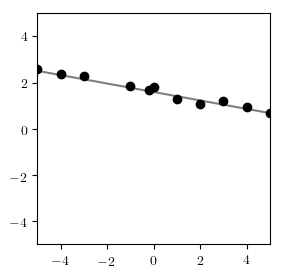


Because a generative function is stochastic, we need to visualize many runs in order to understand its behavior. The cell below renders a grid of traces.


```julia
function grid(renderer::Function, traces; ncols=6, nrows=3)
    figure(figsize=(16, 8))
    for (i, trace) in enumerate(traces)
        subplot(nrows, ncols, i)
        renderer(trace)
    end
end;
```

Now, we generate several traces and render them in a grid


```julia
traces = [Gen.simulate(line_model, (xs,)) for _=1:12]
grid(render_trace, traces)
```


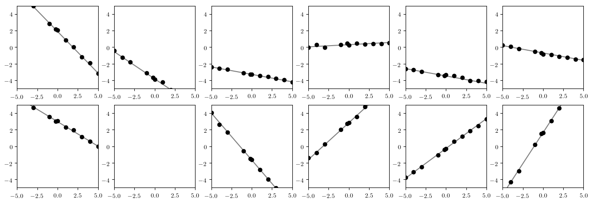


-------------------------------------------------
### Exercise

Write a generative function that uses the same address twice. Run it to see what happens.

-------------------------------
### Exercise

Write a model that generates a sine wave with random phase, period and amplitude, and then generates y-coordinates from a given vector of x-coordinates by adding noise to the value of the wave at each x-coordinate.
Use a  `gamma(5, 1)` prior distribution for the period, and a `gamma(1, 1)` prior distribution on the amplitude (see [`Gen.gamma`](https://probcomp.github.io/Gen/dev/ref/distributions/#Gen.gamma)). Use a uniform distribution for the phase (see [`Gen.uniform`](https://probcomp.github.io/Gen/dev/ref/distributions/#Gen.uniform)). Write a function that renders the trace by showing the data set and the sine wave. Visualize a grid of traces and discuss the distribution. Try tweaking the parameters of each of the prior distributions and seeing how the behavior changes.

### Solution


```julia
@gen function sine_model(xs::Vector{Float64})
    n = length(xs)
    phase = @trace(uniform(0, 2 * pi), :phase)
    period = @trace(gamma(5, 1), :period)
    amplitude = @trace(gamma(1, 1), :amplitude)
    for (i, x) in enumerate(xs)
        mu = amplitude * sin(2 * pi * x / period + phase)
        @trace(normal(mu, 0.1), (:y, i))
    end
    return n
end;
```


```julia
function render_sine_trace(trace; show_data=true)
    xs = get_args(trace)[1]
    xmin = minimum(xs)
    xmax = maximum(xs)
    if show_data
        ys = [trace[(:y, i)] for i=1:length(xs)]
        scatter(xs, ys, c="black")
    end
    
    phase = trace[:phase]
    period = trace[:period]
    amplitude = trace[:amplitude]
    
    test_points = collect(range(xmin, stop=xmax, length=100))
    plot(test_points, amplitude * sin.(2 * pi * test_points / period .+ phase))
    
    ax = gca()
    ax[:set_xlim]((xmin, xmax))
    ax[:set_ylim]((xmin, xmax))
end;
```


```julia
traces = [Gen.simulate(sine_model, (xs,)) for _=1:12];
```


```julia
figure(figsize=(16, 8))
for (i, trace) in enumerate(traces)
    subplot(3, 6, i)
    render_sine_trace(trace)
end
```


## 3. Doing Posterior inference  <a name="doing-inference"></a>

We now will provide a data set of y-coordinates and try to draw inferences about the process that generated the data. We begin with the following data set:


```julia
ys = [6.75003, 6.1568, 4.26414, 1.84894, 3.09686, 1.94026, 1.36411, -0.83959, -0.976, -1.93363, -2.91303];
```


```julia
figure(figsize=(3,3))
scatter(xs, ys, color="black");
```


We will assume that the line model was responsible for generating the data, and infer values of the slope and intercept that explain the data.

To do this, we write a simple *inference program* that takes the model we are assuming generated our data, the data set, and the amount of computation to perform, and returns a trace of the function that is approximately sampled from the _posterior distribution_ on traces of the function, given the observed data. That is, the inference program will try to find a trace that well explains the dataset we created above. We can inspect that trace to find estimates of the slope and intercept of a line that fits the data.

Functions like `importance_resampling` expect us to provide a _model_ and also an _choice map_ representing our data set and relating it to the model. A choice map maps random choice addresses from the model to values from our data set. Here, we want to tie model addresses like `(:y, 4)` to data set values like `ys[4]`:


```julia
function do_inference(model, xs, ys, amount_of_computation)
    
    # Create a choice map that maps model addresses (:y, i)
    # to observed values ys[i]. We leave :slope and :intercept
    # unconstrained, because we want them to be inferred.
    observations = Gen.choicemap()
    for (i, y) in enumerate(ys)
        observations[(:y, i)] = y
    end
    
    # Call importance_resampling to obtain a likely trace consistent
    # with our observations.
    (trace, _) = Gen.importance_resampling(model, (xs,), observations, amount_of_computation);
    return trace
end;
```

We can run the inference program to obtain a trace, and then visualize the result:


```julia
trace = do_inference(line_model, xs, ys, 100)
figure(figsize=(3,3))
render_trace(trace);
```


We see that `importance_resampling` found a reasonable slope and intercept to explain the data. We can also visualize many samples in a grid:


```julia
traces = [do_inference(line_model, xs, ys, 100) for _=1:10];
grid(render_trace, traces)
```


We can see here that there is some uncertainty: with our limited data, we can't be 100% sure exactly where the line is. We can get a better sense for the variability in the posterior distribution by visualizing all the traces in one plot, rather than in a grid. Each trace is going to have the same observed data points, so we only plot those once, based on the values in the first trace:


```julia
function overlay(renderer, traces; same_data=true, args...)
    renderer(traces[1], show_data=true, args...)
    for i=2:length(traces)
        renderer(traces[i], show_data=!same_data, args...)
    end
end;
```


```julia
traces = [do_inference(line_model, xs, ys, 100) for _=1:10];
figure(figsize=(3,3))
overlay(render_trace, traces);
```


--------------

### Exercise

The results above were obtained for `amount_of_computation = 100`. Run the algorithm with this value set to `1`, `10`, and `1000`, etc.  Which value seems like a good tradeoff between accuracy and running time? Discuss.

------------------

### Exercise
Consider the following data set.


```julia
ys_sine = [2.89, 2.22, -0.612, -0.522, -2.65, -0.133, 2.70, 2.77, 0.425, -2.11, -2.76];
```


```julia
figure(figsize=(3, 3));
scatter(xs, ys_sine, color="black");
```


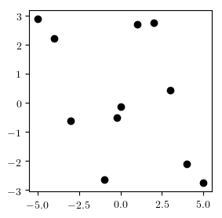


Write an inference program that generates traces of `sine_model` that explain this data set. Visualize the resulting distribution of traces. Temporarily change the prior distribution on the period to be `gamma(1, 1)`  (by changing and re-running the cell that defines `sine_model` from a previous exercise). Can you explain the difference in inference results when using `gamma(1, 1)` vs `gamma(5, 1)` prior on the period? How much computation did you need to get good results?

## 4. Predicting new data  <a name="predicting-data"></a>

Using the API method [`generate`](https://probcomp.github.io/Gen/dev/ref/gfi/#Gen.generate), we can generate a trace of a generative function in which the values of certain random choices constrained to given values. The constraints are a choice map that maps the addresses of the constrained random choices to their desired values. 

For example:


```julia
constraints = Gen.choicemap()
constraints[:slope] = 0.
constraints[:intercept] = 0.
(trace, _) = Gen.generate(line_model, (xs,), constraints)
figure(figsize=(3,3))
render_trace(trace);
```


Note that the random choices corresponding to the y-coordinates are still made randomly. Run the cell above a few times to verify this.

We will use the ability to run constrained executions of a generative function to predict the value of the y-coordinates at new x-coordinates by running new executions of the model generative function in which the random choices corresponding to the parameters have been constrained to their inferred values.  We have provided a function below (`predict_new_data`) that takes a trace, and a vector of new x-coordinates, and returns a vector of predicted y-coordinates corresponding to the x-coordinates in `new_xs`. We have designed this function to work with multiple models, so the set of parameter addresses is an argument (`param_addrs`):


```julia
function predict_new_data(model, trace, new_xs::Vector{Float64}, param_addrs)
    
    # Copy parameter values from the inferred trace (`trace`)
    # into a fresh set of constraints.
    constraints = Gen.choicemap()
    for addr in param_addrs
        constraints[addr] = trace[addr]
    end
    
    # Run the model with new x coordinates, and with parameters 
    # fixed to be the inferred values
    (new_trace, _) = Gen.generate(model, (new_xs,), constraints)
    
    # Pull out the y-values and return them
    ys = [new_trace[(:y, i)] for i=1:length(new_xs)]
    return ys
end;
```

The cell below defines a function that first performs inference on an observed data set `(xs, ys)`, and then runs `predict_new_data` to generate predicted y-coordinates. It repeats this process `num_traces` times, and returns a vector of the resulting y-coordinate vectors.


```julia
function infer_and_predict(model, xs, ys, new_xs, param_addrs, num_traces, amount_of_computation)
    pred_ys = []
    for i=1:num_traces
        trace = do_inference(model, xs, ys, amount_of_computation)
        push!(pred_ys, predict_new_data(model, trace, new_xs, param_addrs))
    end
    pred_ys
end;
```

Finally, we define a cell that plots the observed data set `(xs, ys)` as red dots, and the predicted data as small black dots.


```julia
function plot_predictions(xs, ys, new_xs, pred_ys)
    scatter(xs, ys, color="red")
    for pred_ys_single in pred_ys
        scatter(new_xs, pred_ys_single, color="black", s=1, alpha=0.3)
    end
end;
```

Recall the original dataset for the line model. The x-coordinates span the interval -5 to 5.


```julia
figure(figsize=(3,3))
scatter(xs, ys, color="red");
```


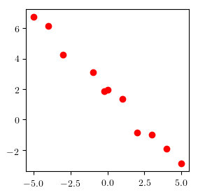


We will use the inferred values of the parameters to predict y-coordinates for x-coordinates in the interval 5 to 10 from which data was not observed. We will also predict new data within the interval -5 to 5, and we will compare this data to the original observed data. Predicting new data from inferred parameters, and comparing this new data to the observed data is the core idea behind *posterior predictive checking*. This tutorial does not intend to give a rigorous overview behind techniques for checking the quality of a model, but intends to give high-level intuition.


```julia
new_xs = collect(range(-5, stop=10, length=100));
```

We generate and plot the predicted data:


```julia
pred_ys = infer_and_predict(line_model, xs, ys, new_xs, [:slope, :intercept], 20, 1000)
figure(figsize=(3,3))
plot_predictions(xs, ys, new_xs, pred_ys)
```


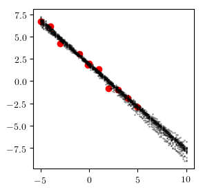


The results look reasonable, both within the interval of observed data and in the extrapolated predictions on the right.

Now consider the same experiment run with following data set, which has significantly more noise.


```julia
ys_noisy = [5.092, 4.781, 2.46815, 1.23047, 0.903318, 1.11819, 2.10808, 1.09198, 0.0203789, -2.05068, 2.66031];
```


```julia
pred_ys = infer_and_predict(line_model, xs, ys_noisy, new_xs, [:slope, :intercept], 20, 1000)
figure(figsize=(3,3))
plot_predictions(xs, ys_noisy, new_xs, pred_ys)
```


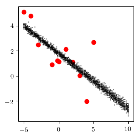


It looks like the generated data is less noisy than the observed data in the regime where data was observed, and it looks like the forecasted data is too overconfident. This is a sign that our model is mis-specified. In our case, this is because we have assumed that the noise has value 0.1. However, the actual noise in the data appears to be much larger. We can correct this by making the noise a random choice as well and inferring its value along with the other parameters.

We first write a new version of the line model that samples a random choice for the noise from a `gamma(1, 1)` prior distribution.


```julia
@gen function line_model_2(xs::Vector{Float64})
    n = length(xs)
    slope = @trace(normal(0, 1), :slope)
    intercept = @trace(normal(0, 2), :intercept)
    noise = @trace(gamma(1, 1), :noise)
    for (i, x) in enumerate(xs)
        @trace(normal(slope * x + intercept, noise), (:y, i))
    end
    return nothing
end;
```

Then, we compare the predictions using inference the unmodified and modified model on the `ys` data set:


```julia
figure(figsize=(6,3))

pred_ys = infer_and_predict(line_model, xs, ys, new_xs, [:slope, :intercept], 20, 1000)
subplot(1, 2, 1)
title("Fixed noise level")
plot_predictions(xs, ys, new_xs, pred_ys)

pred_ys = infer_and_predict(line_model_2, xs, ys, new_xs, [:slope, :intercept, :noise], 20, 10000)
subplot(1, 2, 2)
title("Inferred noise level")
plot_predictions(xs, ys, new_xs, pred_ys)
```


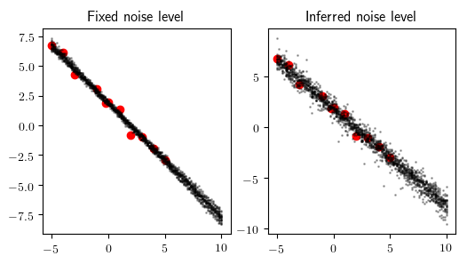


Notice that there is more uncertainty in the predictions made using the modified model.

We also compare the predictions using inference the unmodified and modified model on the `ys_noisy` data set:


```julia
figure(figsize=(6,3))

pred_ys = infer_and_predict(line_model, xs, ys_noisy, new_xs, [:slope, :intercept], 20, 1000)
subplot(1, 2, 1)
title("Fixed noise level")
plot_predictions(xs, ys_noisy, new_xs, pred_ys)

pred_ys = infer_and_predict(line_model_2, xs, ys_noisy, new_xs, [:slope, :intercept, :noise], 20, 10000)
subplot(1, 2, 2)
title("Inferred noise level")
plot_predictions(xs, ys_noisy, new_xs, pred_ys)
```


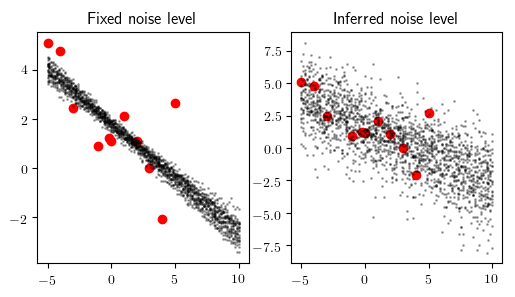


Notice that while the unmodified model was very overconfident, the modified model has an appropriate level of uncertainty, while still capturing the general negative trend.

-------------------------
### Exercise

Write a modified version the sine model that makes noise into a random choice. Compare the predicted data with the observed data `infer_and_predict` and `plot_predictions` for the unmodified and modified model, and for the `ys_sine` and `ys_noisy` datasets. Discuss the results. Experiment with the amount of inference computation used. The amount of inference computation will need to be higher for the model with the noise random choice.

### Solution


```julia
@gen function sine_model_2(xs::Vector{Float64})
    n = length(xs)
    phase = @trace(uniform(0, 2 * pi), :phase)
    period = @trace(gamma(5, 1), :period)
    amplitude = @trace(gamma(1, 1), :amplitude)
    noise = @trace(gamma(1, 1), :noise)
    for (i, x) in enumerate(xs)
        mu = amplitude * sin(2 * pi * x / period + phase)
        @trace(normal(mu, noise), (:y, i))
    end
    return n
end;
```


```julia
figure(figsize=(6,3))

pred_ys = infer_and_predict(sine_model, xs, ys_sine, new_xs, [:phase, :period, :amplitude], 20, 100)

subplot(1, 2, 1)
title("Fixed noise level")
plot_predictions(xs, ys_sine, new_xs, pred_ys)

pred_ys = infer_and_predict(sine_model_2, xs, ys_sine, new_xs, [:phase, :period, :amplitude, :noise], 20, 1000)

subplot(1, 2, 2)
title("Inferred noise level")
plot_predictions(xs, ys_sine, new_xs, pred_ys)
```


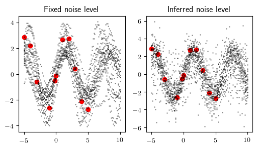


```julia
figure(figsize=(6,3))

pred_ys = infer_and_predict(sine_model, xs, ys_noisy, new_xs, [:phase, :period, :amplitude], 20, 100)

subplot(1, 2, 1)
title("Fixed noise level")
plot_predictions(xs, ys_noisy, new_xs, pred_ys)

pred_ys = infer_and_predict(sine_model_2, xs, ys_noisy, new_xs, [:phase, :period, :amplitude, :noise], 20, 1000)

subplot(1, 2, 2)
title("Inferred noise level")
plot_predictions(xs, ys_noisy, new_xs, pred_ys)
```


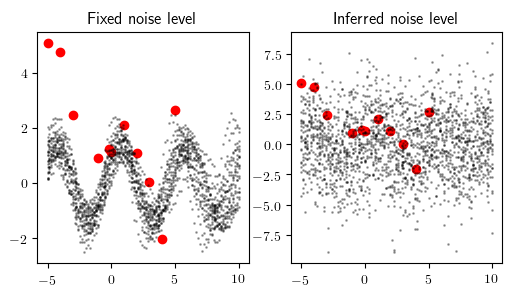


The model with the noise inference is more able to avoid making inaccurate overconfident predictions on the data set (`ys_noisy`) for which the model's assumptios are violated.

## 5. Calling other generative functions  <a name="calling-functions"></a>

In addition to making random choices, generative functions can invoke other generative functions. To illustrate this, we will write a probabilistic model that combines the line model and the sine model. This model is able to explain data using either model, and which model is chosen will depend on the data. This is called *model selection*.

A generative function can invoke another generative function in three ways:

- using regular Julia function call syntax

- using the `@trace` Gen keyword with an address: `@trace(<call>, <addr>)`

- using the `@trace` Gen keyword without an address: `@trace(<call>)`

When invoking using regular function call syntax, the random choices made by the callee function are not traced. When invoking using `@trace` without an address, the random choices of the callee function are placed in the same address namespace as the caller's random choices. When using `@trace(<call>, <addr>)`, the random choices of the callee are placed under the namespace `<addr>`.


```julia
@gen function foo()
    @trace(normal(0, 1), :y)
end

@gen function bar()
    @trace(bernoulli(0.5), :x)
    @trace(foo())
end

@gen function bar_using_namespace()
    @trace(bernoulli(0.5), :x)
    @trace(foo(), :z)
end;
```

We first show the addresses sampled by `bar`:


```julia
trace = Gen.simulate(bar, ())
println(Gen.get_choices(trace))
```

    │
    ├── :y : -0.1555163501029882
    │
    └── :x : false
    


And the addresses sampled by `bar_using_namespace`:


```julia
trace = Gen.simulate(bar_using_namespace, ())
println(Gen.get_choices(trace))
```

    │
    ├── :x : false
    │
    └── :z
        │
        └── :y : -0.3173884162416476
    


Using `@trace` with a namespace can help avoid address collisions for complex models.

A hierarchical address is represented as a Julia `Pair`, where the first element of the pair is the first element of the address and the second element of the pair is the rest of the address:


```julia
trace[Pair(:z, :y)]
```


    -0.3173884162416476


Julia uses the `=>` operator as a shorthand for the `Pair` constructor, so we can access choices at hierarchical addresses like:


```julia
trace[:z => :y]
```


    -0.3173884162416476


If we have a hierarchical address with more than two elements, we can construct the address by chaining the `=>` operator:


```julia
@gen function baz()
    @trace(bar_using_namespace(), :a)
end

trace = simulate(baz, ())

trace[:a => :z => :y]
```


    1.2035666821158528


Note that the `=>` operator associated right, so this is equivalent to:


```julia
trace[Pair(:a, Pair(:z, :y))]
```


    1.2035666821158528


Now, we write a generative function that combies the line and sine models. It makes a Bernoulli random choice (e.g. a coin flip that returns true or false) that determines which of the two models will generate the data.


```julia
@gen function combined_model(xs::Vector{Float64})
    if @trace(bernoulli(0.5), :is_line)
        @trace(line_model_2(xs))
    else
        @trace(sine_model_2(xs))
    end
end;
```

We also write a visualization for a trace of this function:


```julia
function render_combined(trace; show_data=true)
    if trace[:is_line]
        render_trace(trace, show_data=show_data)
    else
        render_sine_trace(trace, show_data=show_data)
    end
end;
```

We visualize some traces, and see that sometimes it samples linear data and other times sinusoidal data.


```julia
traces = [Gen.simulate(combined_model, (xs,)) for _=1:12];
grid(render_combined, traces)
```


We run inference using this combined model on the `ys` data set and the `ys_sine` data set. 


```julia
figure(figsize=(6,3))
subplot(1, 2, 1)
traces = [do_inference(combined_model, xs, ys, 10000) for _=1:10];
overlay(render_combined, traces)
subplot(1, 2, 2)
traces = [do_inference(combined_model, xs, ys_sine, 10000) for _=1:10];
overlay(render_combined, traces)
```


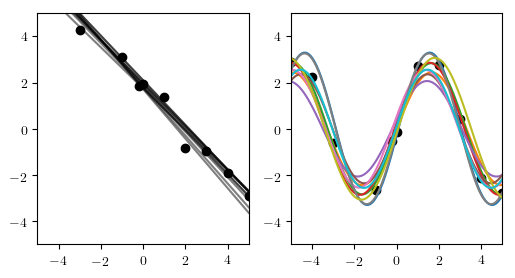


The results should show that the line model was inferred for the `ys` data set, and the sine wave model was inferred for the `ys_sine` data set.

-------

### Exercise

Construct a data set for which it is ambiguous whether the line or sine wave model is best. Visualize the inferred traces using `render_combined` to illustrate the ambiguity. Write a program that takes the data set and returns an estimate of the posterior probability that the data was generated by the sine wave model, and run it on your data set.

Hint: To estimate the posterior probability that the data was generated by the sine wave model, run the inference program many times to compute a large number of traces, and then compute the fraction of those traces in which `:is_line` is false.

------
### Exercise 

There is code that is duplicated between `line_model_2` and `sine_model_2`. Refactor the model to reduce code duplication and improve the readability of the code. Re-run the experiment above and confirm that the results are qualitatively the same. You may need to write a new rendering function. Try to avoid introducing code duplication between the model and the rendering code.

Hint: To avoid introducing code duplication between the model and the rendering code, use the return value of the generative function.


```julia
@gen function line_model_refactored()
    # < your code here >
end;
```


```julia
@gen function sine_model_refactored()
    # < your code here >
end;
```


```julia
@gen function combined_model_refactored(xs::Vector{Float64})
    # < your code here >
end;
```


```julia
function render_combined_refactored(trace; show_data=true)
    xs = Gen.get_args(trace)[1]
    xmin = minimum(xs)
    xmax = maximum(xs)
    if show_data
        ys = [trace[(:y, i)] for i=1:length(xs)]
        scatter(xs, ys, c="black")
    end

    # < your code here >
    
    ax = gca()
    ax[:set_xlim]((xmin, xmax))
    ax[:set_ylim]((xmin, xmax))
end;

```


```julia
figure(figsize=(6,3))
subplot(1, 2, 1)
traces = [do_inference(combined_model_refactored, xs, ys, 10000) for _=1:10];
overlay(render_combined_refactored, traces)
subplot(1, 2, 2)
traces = [do_inference(combined_model_refactored, xs, ys_sine, 10000) for _=1:10];
overlay(render_combined_refactored, traces)
```

## 6. Modeling with an unbounded number of parameters  <a name="infinite-space"></a>

Gen's built-in modeling language can be used to express models that use an unbounded number of parameters. This section walks you through development of a model of data that does not a-priori specify an upper bound on the complexity of the model, but instead infers the complexity of the model as well as the parameters. This is a simple example of a *Bayesian nonparametric* model.

We will consider two data sets:


```julia
xs_dense = collect(range(-5, stop=5, length=50))
ys_simple = fill(1., length(xs_dense)) .+ randn(length(xs_dense)) * 0.1
ys_complex = [Int(floor(abs(x/3))) % 2 == 0 ? 2 : 0 for x in xs_dense] .+ randn(length(xs_dense)) * 0.1;
```


```julia
figure(figsize=(6,3))

subplot(1, 2, 1)
title("ys-simple")
scatter(xs_dense, ys_simple, color="black", s=10)
gca()[:set_ylim]((-1, 3))

subplot(1, 2, 2)
title("ys-complex")
scatter(xs_dense, ys_complex, color="black", s=10)
gca()[:set_ylim]((-1, 3))
```


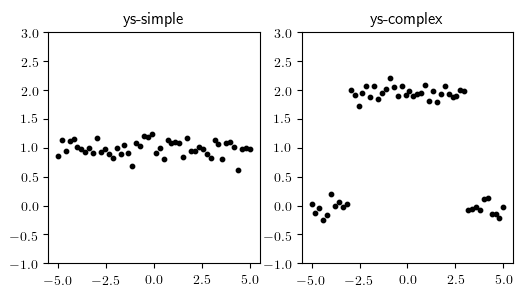


    (-1, 3)


The data set on the left appears to be best explained as a contant function with some noise. The data set on the right appears to include two changepoints, with a constant function in between the changepoints. We want a model that does not a-priori choose the number of changepoints in the data. To do this, we will recursively partition the interval into regions. We define a Julia data structure that represents a binary tree of intervals; each leaf node represents a region in which the function is constant.


```julia
struct Interval
    l::Float64
    u::Float64
end
```


```julia
abstract type Node end
    
struct InternalNode <: Node
    left::Node
    right::Node
    interval::Interval
end

struct LeafNode <: Node
    value::Float64
    interval::Interval
end
```

We now write a generative function that randomly creates such a tree. Note the use of recursion in this function to create arbitrarily large trees representing arbitrarily many changepoints. Also note that we assign the address namespaces `:left` and `:right` to the calls made for the two recursive calls to `generate_segments`.


```julia
@gen function generate_segments(l::Float64, u::Float64)
    interval = Interval(l, u)
    if @trace(bernoulli(0.7), :isleaf)
        value = @trace(normal(0, 1), :value)
        return LeafNode(value, interval)
    else
        frac = @trace(beta(2, 2), :frac)
        mid  = l + (u - l) * frac
        left = @trace(generate_segments(l, mid), :left)
        right = @trace(generate_segments(mid, u), :right)
        return InternalNode(left, right, interval)
    end
end;
```

We also define some helper functions to visualize traces of the `generate_segments` function.


```julia
function render_node(node::LeafNode)
    plot([node.interval.l, node.interval.u], [node.value, node.value])
end

function render_node(node::InternalNode)
    render_node(node.left)
    render_node(node.right)
end;
```


```julia
function render_segments_trace(trace)
    node = get_retval(trace)
    render_node(node)
    ax = gca()
    ax[:set_xlim]((0, 1))
    ax[:set_ylim]((-3, 3))
end;
```

We generate 12 traces from this function and visualize them below. We plot the piecewise constant function that was sampled by each run of the generative function. Different constant segments are shown in different colors. Run the cell a few times to get a better sense of the distribution on functions that is represented by the generative function.


```julia
traces = [Gen.simulate(generate_segments, (0., 1.)) for i=1:12]
grid(render_segments_trace, traces)
```


Because we only sub-divide an interval with 30% probability, most of these sampled traces have only one segment.

Now that we have generative function that generates a random piecewise-constant function, we write a model that adds noise to the resulting constant functions to generate a data set of y-coordinates. The noise level will be a random choice.


```julia
# get_value_at searches a binary tree for
# the leaf node containing some value.
function get_value_at(x::Float64, node::LeafNode)
    @assert x >= node.interval.l && x <= node.interval.u
    return node.value
end

function get_value_at(x::Float64, node::InternalNode)
    @assert x >= node.interval.l && x <= node.interval.u
    if x <= node.left.interval.u
        get_value_at(x, node.left)
    else
        get_value_at(x, node.right)
    end
end

# Out full model
@gen function changepoint_model(xs::Vector{Float64})
    node = @trace(generate_segments(minimum(xs), maximum(xs)), :tree)
    noise = @trace(gamma(1, 1), :noise)
    for (i, x) in enumerate(xs)
        @trace(normal(get_value_at(x, node), noise), (:y, i))
    end
    return node
end;
```

We write a visualization for `changepoint_model` below:


```julia
function render_changepoint_model_trace(trace; show_data=true)
    xs = Gen.get_args(trace)[1]
    node = Gen.get_retval(trace)
    render_node(node)
    if show_data
        ys = [trace[(:y, i)] for i=1:length(xs)]
        scatter(xs, ys, c="black")
    end
    ax = gca()
    ax[:set_xlim]((minimum(xs), maximum(xs)))
    ax[:set_ylim]((-3, 3))
end;
```

Finally, we generate some simulated data sets and visualize them on top of the underlying piecewise constant function from which they were generated:


```julia
traces = [Gen.simulate(changepoint_model, (xs_dense,)) for i=1:12]
grid(render_changepoint_model_trace, traces)
```


Notice that the amount of variability around the piecewise constant mean function differs from trace to trace.

Now we perform inference for the simple data set:


```julia
traces = [do_inference(changepoint_model, xs_dense, ys_simple, 10000) for _=1:12];
grid(render_changepoint_model_trace, traces)
```


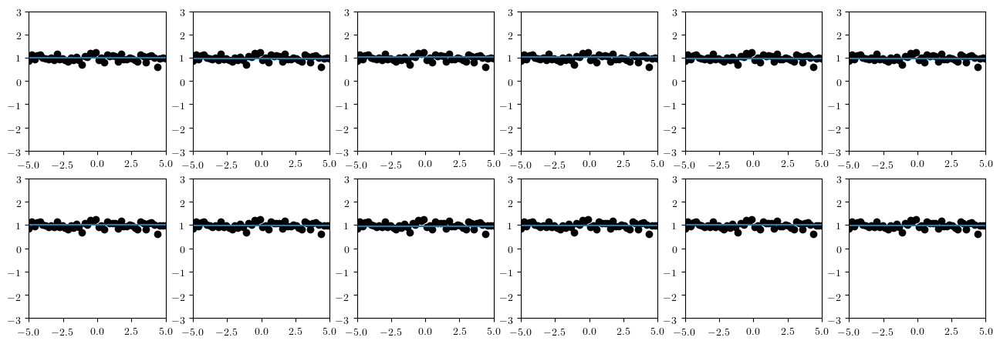


We see that we inferred that the mean function that explains the data is a constant with very high probability.

For inference about the complex data set, we use more computation. You can experiment with different amounts of computation to see how the quality of the inferences degrade with less computation. Note that we are using a very simple generic inference algorithm in this tutorial, which really isn't suited for this more complex task. In later tutorials, we will learn how to write more efficient algorithms, so that accurate results can be obtained with significantly less computation. We will also see ways of annotating the model for better performance, no matter the inference algorithm.


```julia
traces = [do_inference(changepoint_model, xs_dense, ys_complex, 100000) for _=1:12];
grid(render_changepoint_model_trace, traces)
```


The results show that more segments are inferred for the more complex data set.

------
### Exercise
Write a function that takes a data set of x- and y-coordinates and plots the histogram of the probability distribution on the number of changepoints.
Show the results for the `ys_simple` and `ys_complex` data sets.

Hint: The return value of `changepoint_model` is the tree of `Node` values. Walk this tree.

-------

### Exercise
Write a new version of `changepoint_model` that uses `@trace` without an address (e.g. `@trace(<call>)`) to make the recursive calls.

Hint: You will need to guarantee that all addresses are unique. How can you label each node in a binary tree using an integer?
