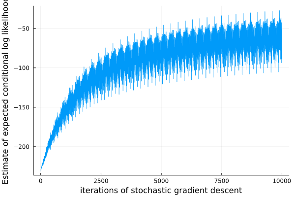

# Modeling with TensorFlow code

So far, we have seen generative functions that are defined only using the built-in modeling language, which uses the `@gen` keyword. However, Gen can also be extended with other modeling languages, as long as they produce generative functions that implement the [Generative Function Interface](https://www.gen.dev/docs/stable/ref/gfi/). The [GenTF](https://github.com/probcomp/GenTF) Julia package provides one such modeling language which allow generative functions to be constructed from user-defined TensorFlow computation graphs. Generative functions written in the built-in language can invoke generative functions defined using the GenTF language.

This notebook shows how to write a generative function in the GenTF language, how to invoke a GenTF generative function from a `@gen` function, and how to perform basic supervised training of a generative function. Specifically, we will train a softmax regression conditional inference model to generate the label of an MNIST digit given the pixels. Later tutorials will show how to use deep learning and TensorFlow to accelerate inference in generative models, using ideas from "amortized inference".

NOTE: Only attempt to run this notebook if you have a working installation of TensorFlow and GenTF (see the [GenTF installation instructions](https://probcomp.github.io/GenTF/dev/#Installation-1)).


```julia
using Gen, Plots
```

First, we load the GenTF package and the PyCall package. The PyCall package is used because TensorFlow computation graphs are constructed using the TensorFlow Python API, and the PyCall package allows Python code to be run from Julia.


```julia
using GenTF, PyCall
```

We text load the TensorFlow and TensorFlow.nn Python modules into our scope. The `@pyimport` macro is defined by PyCall.


```julia
tf = pyimport("tensorflow")
tf.compat.v1.disable_eager_execution()
nn = tf.nn
```


    PyObject <module 'tensorflow._api.v2.nn' from '/Users/alexlew/gen-quickstart/tutorials/tensorflow/venv/lib/python3.8/site-packages/tensorflow/_api/v2/nn/__init__.py'>


Next, we define a TensorFlow computation graph. The graph will have placeholders for an N x 784 matrix of pixel values, where N is the number of images that will be processed in batch, and 784 is the number of pixels in an MNIST image (28x28). There are 10 possible digit classes. The `probs` Tensor is an N x 10 matrix, where each row of the matrix is the vector of normalized probabilities of each digit class for a single input image. Note that this code is largely identical to the corresponding Python code. We provide initial values for the weight and bias parameters that are computed in Julia (it is also possible to use TensorFlow initializers for this purpose).


```julia
# input images, shape (N, 784)
xs = tf.compat.v1.placeholder(tf.float64, shape=(nothing, 784))

# weight matrix parameter for soft-max regression, shape (784, 10)
# initialize to a zeros matrix generated by Julia.
init_W = zeros(Float64, 784, 10)
W = tf.compat.v1.Variable(init_W)

# bias vector parameter for soft-max regression, shape (10,)
# initialize to a zeros vector generated by Julia.
init_b = zeros(Float64, 10)
b = tf.compat.v1.Variable(init_b)

# probabilities for each class, shape (N, 10)
probs = nn.softmax(tf.add(tf.matmul(xs, W), b), axis=1);
```

Next, we construct the generative function from this graph. The GenTF package provides a `TFFunction` type that implements the generative function interface. The `TFFunction` constructor takes:

(i) A vector of Tensor objects that will be the trainable parameters of the generative function (`[W, b]`). These should be TensorFlow variables.

(ii) A vector of Tensor object that are the inputs to the generative function (`[xs]`). These should be TensorFlow placeholders.

(iii) The Tensor object that is the return value of the generative function (`probs`).


```julia
tf_softmax_model = TFFunction([W, b], [xs], probs);
```

The `TFFunction` constructor creates a new TensorFlow session that will be used to execute all TensorFlow code for this generative function. It is also TensorFlow possible to supply a session explicitly to the constructor. See the [GenTF documentation](https://probcomp.github.io/GenTF/dev/) for more details.

We can run the resulting generative function on some fake input data. This causes the TensorFlow to execute code in the TensorFlow session associated with `tf_softmax_model`:


```julia
fake_xs = rand(5, 784)
probs = tf_softmax_model(fake_xs)
println(size(probs))
```

    (5, 10)


We can also use `Gen.initialize` to obtain a trace of this generative function.


```julia
(trace, _) = Gen.generate(tf_softmax_model, (fake_xs,));
```

 Note that generative functions constructed using GenTF do not make random choices:


```julia
Gen.get_choices(trace)
```


    


The return value is the Julia value corresponding to the Tensor `y`:


```julia
println(size(Gen.get_retval(trace)))
```

    (5, 10)


Finally, we write a generative function using the built-in modeling DSL that invokes the TFFunction generative function we just defined. Note that we wrap the call to `tf_softmax_model` in an `@addr` statement.


```julia
@gen function digit_model(xs::Matrix{Float64})
    
    # there are N input images, each with D pixels
    (N, D) = size(xs)
    
    # invoke the `net` generative function to compute the digit label probabilities for all input images
    probs ~ tf_softmax_model(xs)
    @assert size(probs) == (N, 10)
    
    # sample a digit label for each of the N input images
    for i=1:N
        {(:y, i)} ~ categorical(probs[i,:])
    end
end;
```

Let's obtain a trace of `digit_model` on the fake tiny input:


```julia
(trace, _) = Gen.generate(digit_model, (fake_xs,));
```

We see that the `net` generative function does not make any random choices. The only random choices are the digit labels for each input input:


```julia
Gen.get_choices(trace)
```


    │
    ├── (:y, 1) : 6
    │
    ├── (:y, 5) : 8
    │
    ├── (:y, 4) : 3
    │
    ├── (:y, 3) : 4
    │
    ├── (:y, 2) : 8
    │
    └── :probs


Before the `digit_model` will be useful for anything, it needs to be trained. We load some code for loading batches of MNIST training data.

The following cell will ask permission to download MNIST; type "y" at the prompt, if prompted.


```julia
include("mnist.jl")
training_data_loader = MNISTTrainDataLoader();
```

    stdin> yes
    This program has requested access to the data dependency MNIST.
    which is not currently installed. It can be installed automatically, and you will not see this message again.
    
    Dataset: THE MNIST DATABASE of handwritten digits
    Authors: Yann LeCun, Corinna Cortes, Christopher J.C. Burges
    Website: http://yann.lecun.com/exdb/mnist/
    
    [LeCun et al., 1998a]
        Y. LeCun, L. Bottou, Y. Bengio, and P. Haffner.
        "Gradient-based learning applied to document recognition."
        Proceedings of the IEEE, 86(11):2278-2324, November 1998
    
    The files are available for download at the offical
    website linked above. Note that using the data
    responsibly and respecting copyright remains your
    responsibility. The authors of MNIST aren't really
    explicit about any terms of use, so please read the
    website to make sure you want to download the
    dataset.
    
    
    
    Do you want to download the dataset from ["https://ossci-datasets.s3.amazonaws.com/mnist/train-images-idx3-ubyte.gz", "https://ossci-datasets.s3.amazonaws.com/mnist/train-labels-idx1-ubyte.gz", "https://ossci-datasets.s3.amazonaws.com/mnist/t10k-images-idx3-ubyte.gz", "https://ossci-datasets.s3.amazonaws.com/mnist/t10k-labels-idx1-ubyte.gz"] to "/Users/alexlew/.julia/datadeps/MNIST"?
    [y/n]


Now, we train the trainable parameters of the `tf_softmax_model` generative function  (`W` and `b`) on the MNIST traing data. Note that these parameters are stored as the state of the TensorFlow variables. We will use the [`Gen.train!`](https://www.gen.dev/docs/stable/ref/inference/#Gen.train!) method, which supports supervised training of generative functions using stochastic gradient opimization methods. In particular, this method takes the generative function to be trained (`digit_model`), a Julia function of no arguments that generates a batch of training data, and the update to apply to the trainable parameters.

The `ParamUpdate` constructor takes the type of update to perform (in this case a gradient descent update with step size 0.00001), and a specification of which trainable parameters should be updated). Here, we request that the `W` and `b` trainable parameters of the `tf_softmax_model` generative function should be trained.


```julia
update = Gen.ParamUpdate(Gen.FixedStepGradientDescent(0.00001), tf_softmax_model => [W, b]);
```

For the data generator, we obtain a batch of 100 MNIST training images. The data generator must return a tuple, where the first element is a set of arguments to the generative function being trained (`(xs,)`) and the second element contains the values of random choices. `train!` attempts to maximize the expected log probability of these random choices given their corresponding input values.


```julia
function data_generator()
    (xs, ys) = next_batch(training_data_loader, 100)

    @assert size(xs) == (100, 784)
    @assert size(ys) == (100,)
    constraints = Gen.choicemap()
    for (i, y) in enumerate(ys)
        constraints[(:y, i)] = y
    end
    ((xs,), constraints)
end;
```

We run 10000 iterations of stochastic gradient descent, where each iteration uses a batch of 100 images to get a noisy gradient estimate. This might take one or two minutes.


```julia
@time scores = Gen.train!(digit_model, data_generator, update;
    num_epoch=10000, epoch_size=1, num_minibatch=1, minibatch_size=1, verbose=false);
```

     25.649759 seconds (86.57 M allocations: 28.992 GiB, 3.90% gc time, 4.76% compilation time)


We plot an estimate of the objective function function over time:


```julia
plot(scores, xlabel="iterations of stochastic gradient descent", 
    ylabel="Estimate of expected conditional log likelihood", label=nothing)
```


    

    


### Exercise

It is common to "vectorize" deep learning code so that it runs on multiple inputs at a time. This is important for making efficient use of GPU resources when training. The TensorFlow code above is vectorized across images. Construct a new TFFunction that only runs on one image at a time, and use a Julia for loop over multiple invocations of this new TFFunction, one for each image. Run the training procedure for 100 iterations. Comment on the performance difference.

We have provided you with starter code, including a new TensorFlow computation graph where `x` is a placeholder for a single image, and where `probs_unvec` are the digit class probabilities for a single image:


```julia
# input images, shape (784,)
x = tf.compat.v1.placeholder(tf.float64, shape=(784,))

# weight matrix parameter for soft-max regression, shape (784, 10)
# initialize to a zeros matrix generated by Julia.
W_unvec = tf.compat.v1.Variable(init_W)
    
# bias vector parameter for soft-max regression, shape (10,)
# initialize to a zeros vector generated by Julia.
b_unvec = tf.compat.v1.Variable(init_b)

# probabilities for each class, shape (10,)
probs_unvec = tf.squeeze(nn.softmax(tf.add(tf.matmul(tf.expand_dims(x, axis=0), W_unvec), b_unvec), axis=1), axis=0);
```

We also provide you with the definition of the new TFFunction based on this computation graph:


```julia
tf_softmax_model_single = TFFunction([W_unvec, b_unvec], [x], probs_unvec);
```

We will use an update that modifies the parameters of `tf_softmax_model_single`:


```julia
update_unvec = Gen.ParamUpdate(Gen.FixedStepGradientDescent(0.00001), tf_softmax_model_single => [W_unvec, b_unvec]);
```

Fill in the missing sections in the cells below.


```julia
@gen function digit_model_single_image(x::Vector{Float64})
    
    # number of pixels in the image
    D = length(x)
    
    # < your code here >
    
    # sample the digit label for the image
    @trace(categorical(probs), :y)
    
    return nothing
end;
```


```julia
@gen function digit_model_unvectorized(xs::Matrix{Float64})
    (N, D) = size(xs)
    for i=1:N

         # < your code here >
    
    end
    
    return nothing
end;
```

After you have filled in the cells above, try running `digit_model_unvectorized` on some input to help debug your solution. 

Next, fill in the data generator that you will use to train the new model:


```julia
function data_generator_unvectorized()
    (xs, ys) = next_batch(training_data_loader, 100)
    @assert size(xs) == (100, 784)
    @assert size(ys) == (100,)
    
    # < your code here >
    
end;
```

Finally, perform the training:


```julia
@time scores_unvec = Gen.train!(digit_model_unvectorized, data_generator_unvectorized, update_unvec;
    num_epoch=10000, epoch_size=1, num_minibatch=1, minibatch_size=1, verbose=false);
```


```julia
plot(scores_unvec)
xlabel("iterations of stochastic gradient descent")
ylabel("Estimate of expected conditional log likelihood");
```
